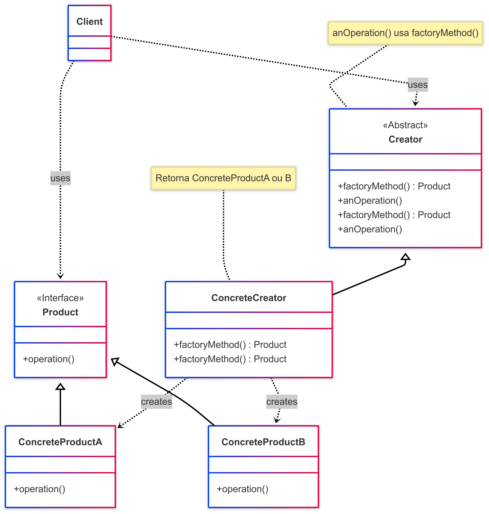

# Factory

## 1. Introdução ao Padrão Factory Method

O padrão de projeto Factory Method é um padrão de criação que fornece uma interface para criar objetos em uma superclasse, mas permite que as subclasses (ou um método dentro de uma classe com lógica condicional) alterem o tipo de objetos que serão criados. Essencialmente, ele encapsula a lógica de instanciação de objetos, delegando a responsabilidade de qual classe concreta instanciar.

Este padrão é útil quando uma classe não pode antecipar a classe de objetos que deve criar ou quando uma classe quer que suas subclasses especifiquem os objetos que ela cria.

### 1.1. Problema que o Factory Method Resolve

Frequentemente, durante o desenvolvimento de software, nos deparamos com situações onde precisamos criar diferentes tipos de objetos que compartilham uma interface ou superclasse comum, mas a decisão exata de qual objeto criar depende de alguma condição ou parâmetro que pode variar em tempo de execução.

O Factory Method resolve os seguintes problemas:

- **Encapsulamento da Lógica de Criação**: Isola o código cliente da complexidade e das especificidades da criação de objetos concretos. O cliente não precisa saber qual classe específica está sendo instanciada.
- **Desacoplamento**: Reduz o acoplamento entre o código cliente e as classes concretas dos produtos. O cliente interage apenas com a interface do produto.
- **Flexibilidade e Extensibilidade**: Facilita a introdução de novos tipos de produtos sem modificar o código cliente.
- **Princípio Aberto/Fechado**: Permite que o sistema seja aberto para extensão (novos produtos podem ser adicionados) mas fechado para modificação (o código cliente existente que usa a fábrica não precisa mudar).

### 1.2. Estrutura e Participantes

O padrão Factory Method geralmente envolve os seguintes participantes:

- **Product (Produto)**:  
  Define a interface (ou classe abstrata) para os objetos que o método fábrica cria.  
  **No código**: As funções decoradoras `_verificar_post` e `_verificar_comentario`.

- **ConcreteProduct (Produto Concreto)**:  
  Implementa a interface do Produto.  
  **No código**: As funções específicas `_verificar_post` e `_verificar_comentario`.

- **Creator (Criador / Factory)**:  
  Declara o método fábrica que retorna um objeto do tipo Produto.  
  **No código**: A classe `VerificadorPermissaoFactory` com o método estático `criar_verificador`.

- **ConcreteCreator (Criador Concreto)**:  
  Sobrescreve o método fábrica para retornar uma instância de um ProdutoConcreto específico.  
  **No código**: A lógica condicional dentro de `criar_verificador`.

### 1.3. Variações Comuns

- **Simple Factory**: Uma única classe com um método estático que cria objetos com base em um parâmetro.
- **Factory Method**: Usa herança. Uma classe abstrata define `factoryMethod()` e subclasses o implementam.
- **Abstract Factory**: Interface para criar famílias de objetos relacionados sem especificar as classes concretas.

O `VerificadorPermissaoFactory` usa uma abordagem entre Simple Factory e Factory Method.

### 1.4. Diagrama UML (Factory Method)


**Figura 1**: Representação UML do Padrão Factory Method (Clássico)


<font size="3"><p style="text-align: center"><b>Figura 1:</b> Representação UML do Factory </p></font>
<center>



</center>

<font size="3"><p style="text-align: center"><b>Autores</b>: [Milena Rocha](https://github.com/milenafrocha), [Rafael Pereira](https://github.com/rafgpereira), [Letícia Mrtins](https://github.com/leticiatmartins), 2025.</p></font>

### 1.5. Como Funciona

1. O Cliente chama o método fábrica no objeto Criador.
2. O Criador decide qual tipo de Produto Concreto criar.
3. O Produto Concreto é criado.
4. O método fábrica retorna esse produto ao Cliente.
5. O Cliente usa o Produto sem conhecer sua classe concreta.

### 1.6. Benefícios

* Encapsulamento da Lógica de Criação
* Redução do Acoplamento
* Maior Flexibilidade e Extensibilidade
* Adesão ao Princípio Aberto/Fechado
* Código Mais Limpo e Organizado

### 1.7. Desvantagens

* Aumento da Complexidade
* Hierarquia de Classes Paralelas (caso use herança tradicional)

---

## 2. Aplicação do Padrão Factory no Projeto: 

No projeto, a classe `VerificadorPermissaoFactory` cria dinamicamente funções decoradoras que verificam permissões de usuário para diferentes tipos de entidades.

**Localização**: [projeto/grupo1/backend/app/decorators/auth_decorator.py](https://github.com/UnBArqDsw2025-1-Turma02/2025.1-T02-_G7_PlanetarioVirtual_Entrega_03/blob/main/projeto/grupo1/backend/app/decorators/auth_decorator.py)

### 2.1. `VerificadorPermissaoFactory`: Criação Dinâmica de Decoradores

### 2.1.1. Contexto do Problema

* Usuário pode deletar seu próprio post/comentário.
* Moderador pode deletar qualquer post/comentário.

### 2.1.2. Solução com `VerificadorPermissaoFactory`

* `criar_verificador(tipo_entidade: str)` escolhe qual decorador retornar com base em `"post"` ou `"comentario"`.
* Ambas as funções compartilham a mesma "interface" como decoradores.

### 2.1.3. Exemplo: Verificador para `"post"`

#### a) Entrada

```python
tipo_entidade = "post"
```

#### b) Produto Gerado

```python
VerificadorPermissaoFactory._verificar_post
```

#### c) Código da Factory

```python
# app/decorators/factory/verificador_factory.py

class VerificadorPermissaoFactory:
    @staticmethod
    def criar_verificador(tipo_entidade: str):
        if tipo_entidade == "post":
            return VerificadorPermissaoFactory._verificar_post
        elif tipo_entidade == "comentario":
            return VerificadorPermissaoFactory._verificar_comentario
        else:
            raise ValueError("Tipo de entidade inválido para verificação de permissão.")

    @staticmethod
    def _verificar_post(func):
        @wraps(func)
        async def wrapper(id_post: int, user_id: int, *args, **kwargs):
            user = forum_service.get_user_by_id(user_id)
            if not user:
                raise HTTPException(status_code=404, detail="Usuário não encontrado.")
            if user.tipo == "moderador":
                return await func(id_post=id_post, user_id=user_id, *args, **kwargs)
            post = post_service.get_post_by_id(id_post)
            if not post:
                raise HTTPException(status_code=404, detail="Postagem não encontrada.")
            if post.autor_id == user.id:
                return await func(id_post=id_post, user_id=user_id, *args, **kwargs)
            raise HTTPException(status_code=403, detail="Apenas o autor ou moderador pode excluir esta postagem.")
        return wrapper
```

#### d) Utilização (Exemplo em Endpoint FastAPI)

```python
from fastapi import APIRouter, Depends
from app.auth import get_current_user_id
from app.decorators.factory.verificador_factory import VerificadorPermissaoFactory

router = APIRouter()
verificador_permissao_post = VerificadorPermissaoFactory.criar_verificador("post")

@router.delete("/posts/{id_post}", summary="Deletar uma postagem")
@verificador_permissao_post
async def deletar_post_endpoint(id_post: int, current_user_id: int = Depends(get_current_user_id)):
    """
    Deleta uma postagem.
    A permissão é verificada pelo decorador @verificador_permissao_post.
    """
    # Se chegou aqui, a permissão foi concedida
    # Lógica para deletar o post
```

#### e)  [Link do deploy para teste](https://two025-1-t02-g7-planetariovirtual.onrender.com/docs#/)

> https://two025-1-t02-g7-planetariovirtual.onrender.com/docs#/


## Referências Bibliográficas

> 1. REFACTORING GURU. Adapter Pattern. Refactoring Guru, [s.d.]. Disponível em: https://refactoring.guru/design-patterns/adapter. Acesso em: 30 mai. 2025.
>
> 2. GAMMA, E.; HELM, R.; JOHNSON, R.; VLISSIDES, J. Design Patterns: Elements of Reusable Object-Oriented Software. Reading, MA: Addison-Wesley, 1995.
>
> 3. IBM. *Exemplo: definindo métodos de fábrica*. IBM Documentation, z/OS 6.4. Disponível em: [https://www.ibm.com/docs/pt-br/cobol-zos/6.4.0?topic=section-example-defining-factory-methods](https://www.ibm.com/docs/pt-br/cobol-zos/6.4.0?topic=section-example-defining-factory-methods). Acesso em: 1 jun. 2025.

## Histórico de Versões

| Versão | Data       | Descrição                                      | Autor               | Revisor            |
|--------|------------|------------------------------------------------|---------------------|--------------------|
| 1.0    | 01/06/2025 | Criação do documento com a introdução do factory | [Milena Rocha](https://github.com/milenafrocha), [Rafael Pereira](https://github.com/rafgpereira), [Letícia Torres](https://github.com/leticiatmartins)  | [Joao Pedro](https://github.com/joaopedrooss)          | 
| 1.1    | 01/06/2025 | Adição dos Autores | [Milena Rocha](https://github.com/milenafrocha), [Rafael Pereira](https://github.com/rafgpereira), [Letícia Torres](https://github.com/leticiatmartins)  | [Joao Pedro](https://github.com/joaopedrooss)          |
