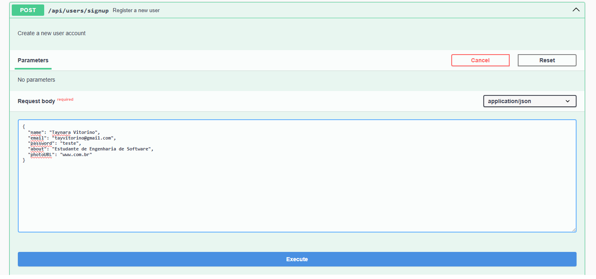

# Builder

## 1. Introdução ao Padrão Builder

## 2. Visão Geral do Projeto

O objetivo principal é gerenciar usuários, permitindo operações CRUD (Criar, Ler, Atualizar, Deletar) e autenticação. A característica distintiva é a aplicação do padrão Builder para a construção de objetos `User`, o que promove um código mais limpo e manutenível, especialmente quando os objetos têm muitos atributos opcionais.

### 2.1. Tecnologias Principais

- **Java**: Linguagem de programação principal.  
- **Spring Framework**: Para construção da API RESTful e gerenciamento de dependências.  
- **Spring Data JPA**: Para persistência de dados.  
- **Swagger (OpenAPI)**: Para documentação da API. 
- **Padrão de Projeto Builder**: Para a criação de objetos `User`.

### 2.2. Estrutura do Projeto

O projeto é organizado em pacotes distintos para DTOs, modelos, serviços e builders.

```
.
├── src
│   └── main
│       └── java
│           └── com
│               └── ArqDSw
│                   └── planetario_virtual_backend
│                       ├── ENUM
│                       │   └── UserType.java
│                       ├── builder
│                       │   ├── AdminUserBuilder.java
│                       │   ├── RegisteredUserBuilder.java
│                       │   └── UserBuilder.java
│                       ├── dto
│                       │   ├── UserDTO.java
│                       │   ├── UserLoginDTO.java
│                       │   └── UserResponseDTO.java
│                       ├── model
│                       │   └── User.java
│                       ├── repository
│                       │   └── UserRepository.java
│                       └── service
│                           └── UserService.java
```

---

## 3. Padrão de Projeto Builder

O padrão Builder separa a construção de um objeto complexo da sua representação.

### 3.1. Componentes do Builder

#### User (Produto)

Classe com atributos como `id`, `name`, `email`, `password`, `about`, `photoURL` e `userType`.

```java
@Entity
@Table(name="tb_users")
public class User {
    ...
    public User(UserBuilder<?> builder) {
        this.id = builder.getId(); 
        this.name = builder.getName(); 
        this.email = builder.getEmail(); 
        this.password = builder.getPassword(); 
        this.about = builder.getAbout(); 
        this.photoURL = builder.getPhotoURL();
        this.userType = builder.getUserType(); 
        ...
    }
}
```

#### UserBuilder (Builder Abstrato)

Define métodos para construir um `User` com atributos encadeáveis.

```java
public abstract class UserBuilder<T extends UserBuilder<T>> {
    ...
    public abstract User build();
    protected abstract T self();
}
```

#### RegisteredUserBuilder e AdminUserBuilder (Builders Concretos)

Constroem usuários com tipos específicos:

```java
public class RegisteredUserBuilder extends UserBuilder<RegisteredUserBuilder> {
    public RegisteredUserBuilder(String name, String email, String password) {
        super(name, email, password, UserType.REGISTERED);
    }
    ...
}
```

```java
public class AdminUserBuilder extends UserBuilder<AdminUserBuilder> {
    public AdminUserBuilder(String name, String email, String password) {
        super(name, email, password, UserType.ADMIN);
    }
    ...
}
```

#### UserType (Enum)

```java
public enum UserType {
    ADMIN,
    REGISTERED 
}
```

### 3.2. Benefícios do Builder no Projeto

- **Separação da lógica de construção**
- **Flexibilidade**
- **Facilidade de manutenção**
- **Validação na construção**

---

## 4. DTOs (Data Transfer Objects)

### UserDTO

```java
public class UserDTO {
    private String name;
    private String email;
    private String password;
    private String about; 
    private String photoURL;
    ...
}
```

### UserLoginDTO

```java
public class UserLoginDTO {
    @NotBlank 
    @Email   
    private String email;
    @NotBlank
    private String password;
    @Schema(accessMode = Schema.AccessMode.READ_ONLY)
    private String token;
    ...
}
```

### UserResponseDTO

```java
public class UserResponseDTO {
    private Long id;
    private String name;
    private String email;
    private String about;
    private String photoURL;
    ...
}
```

---

## 5. UserService

Camada de serviço com lógica de negócio de usuários.

### 5.1. Funcionalidade Principal

#### `createUser(UserDTO userDTO)`

- Verifica se o e-mail já existe.
- Usa `RegisteredUserBuilder`.
- Codifica a senha.
- Salva e retorna `UserResponseDTO`.

```java
public UserResponseDTO createUser(UserDTO userDTO) {
    if (userRepository.existsByEmail(userDTO.getEmail())) {
        throw new DuplicateEmailException("Email already in use: " + userDTO.getEmail());
    }

    User newUser = new RegisteredUserBuilder(
            userDTO.getName(),
            userDTO.getEmail(),
            passwordEncoder.encode(userDTO.getPassword()) 
        )
        .about(userDTO.getAbout()) 
        .photoURL(userDTO.getPhotoURL()) 
        .build();

    User savedUser = userRepository.save(newUser);
    return convertToResponseDTO(savedUser);
}
```

### 6. Execução do Projeto

Utilizamos o Swagger para execução e teste das rotas criadas. 

<font size="3"><p style="text-align: center"><b>Figura 1:</b> Rota de Cadastro de Usuário no Swagger </p></font>
<center>



</center>

<font size="3"><p style="text-align: center"><b>Autores</b>: [Antonio Júnior](https://github.com/antonioleaojr), [Carlos Paz](https://github.com/dudupaz), [Rapahela Guimarães](https://github.com/raphaiela), [Taynara Vitorino](https://github.com/taybalau) 2025.</p></font>

<font size="3"><p style="text-align: center"><b>Figura 2:</b> Resposta após Realização do Cadastro </p></font>
<center>


</center>

<font size="3"><p style="text-align: center"><b>Autores</b>: [Antonio Júnior](https://github.com/antonioleaojr), [Carlos Paz](https://github.com/dudupaz), [Rapahela Guimarães](https://github.com/raphaiela), [Taynara Vitorino](https://github.com/taybalau) 2025.</p></font>


### 6.1 Deploy

[Link para acesso ao Swagger](https://worthy-latia-planetario-virtual-02f6584c.koyeb.app/swagger-ui/index.html)


## Referências Bibliográficas

> 1. REFACTORING GURU. Adapter Pattern. Refactoring Guru, [s.d.]. Disponível em: https://refactoring.guru/design-patterns/builder. Acesso em: 30 mai. 2025.

## Histórico de Versões

| Versão | Data       | Descrição                                      | Autor               | Revisor            |
|--------|------------|------------------------------------------------|---------------------|--------------------|
| 1.0    | 02/06/2025 | Criação do documento | [Taynara Vitorino](https://github.com/taybalau)  | [Antonio Júnior](https://github.com/antonioleaojr)          | 
