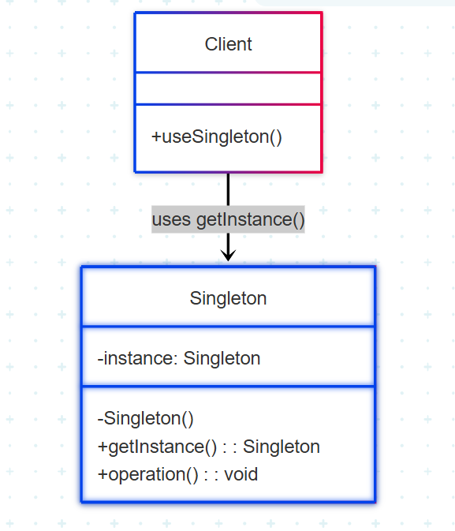

# Singleton

## 1. Introdução ao Padrão Singleton Method

O padrão de projeto Singleton é um padrão de criação que garante que uma classe tenha apenas uma instância e fornece um ponto global de acesso a essa instância. É utilizado quando se deseja evitar a criação de múltiplos objetos da mesma classe, centralizando seu uso e controle.

Esse padrão é ideal quando uma única instância de uma classe deve coordenar ações em todo o sistema, como gerenciadores de configuração, controle de logs, ou acesso a um recurso compartilhado.

### 1.1. Problema que o Singleton Method Resolve

Em muitas aplicações, é necessário garantir que apenas um único objeto de determinada classe seja criado, principalmente quando se trata de recursos globais ou compartilhados. Criar múltiplas instâncias pode levar a inconsistências, uso redundante de memória ou conflitos de estado.

O padrão Singleton resolve os seguintes problemas:

- **Controle de Instância Única**: Assegura que uma única instância de uma classe exista durante toda a execução da aplicação.

- **Ponto Global de Acesso**: Permite que diferentes partes do sistema acessem essa instância única de forma controlada e consistente.

- **Gerenciamento de Recursos Compartilhados**: Evita a duplicação de componentes que representam recursos pesados ou que não devem ser replicados.

### 1.2. Estrutura e Participantes

O padrão Singleton envolve principalmente os seguintes elementos:

- **Singleton (Instância Única)**:  
  Define uma classe com um método estático responsável por controlar a criação da instância e fornecer o acesso global a ela.  

- **ConcreteProduct (Produto Concreto)**:  
  Implementa a interface do Produto.  

- **Creator (Criador / Factory)**:  
  Declara o método fábrica que retorna um objeto do tipo Produto.  

- **ConcreteCreator (Criador Concreto)**:  
  Sobrescreve o método fábrica para retornar uma instância de um ProdutoConcreto específico.  

### 1.3. Variações Comuns

- **Lazy Initialization (Inicialização Preguiçosa)**: A instância é criada apenas quando for necessária, o que economiza recursos.
- **Eager Initialization (Inicialização Antecipada)**: A instância é criada assim que a classe é carregada, garantindo disponibilidade imediata.
- **Thread-Safe Singleton**: Abordagens que garantem segurança em ambientes com múltiplas threads, geralmente com uso de sincronização.


### 1.4. Diagrama UML (Factory Method)


**Figura 1**: Representação UML do Padrão Singleton 


<font size="3"><p style="text-align: center"><b>Figura 1:</b> Representação UML do Singleton </p></font>
<center>



</center>

<font size="3"><p style="text-align: center"><b>Autores</b>: [João Lucas](https://github.com/jlucasiqueira), 2025.</p></font>

### 1.5. Como Funciona

1. O Client chama Singleton.getInstance().
2. O método getInstance() verifica se a instância já existe.
3. Se não existir, ela é criada.
4. A mesma instância é retornada a cada nova chamada.
5. O cliente chama os métodos públicos da instância única, como operation().

### 1.6. Benefícios

* Garante existência de uma única instância
* Reduz o consumo de recursos
* Proporciona acesso global controlado
* Facilita o compartilhamento de informações e estados
* Simples de implementar e utilizar*

### 1.7. Desvantagens

* Pode introduzir estado global indesejado
* Pode dificultar testes unitários e injeção de dependência
* Viola o princípio da responsabilidade única (SRP)
* Pode criar dependências ocultas entre classes

## 2. Aplicação do Padrão Singleton no Projeto: 

No projeto, a classe NasaApodAdapter aplica o padrão Singleton para garantir que apenas uma única instância do adaptador de comunicação com a API da NASA seja criada e reutilizada ao longo da aplicação.

**Localização**: [projeto/grupo2/fotos/nasaApodAdapter.js](https://github.com/UnBArqDsw2025-1-Turma02/2025.1-T02-_G7_PlanetarioVirtual_Entrega_03/blob/main/projeto/grupo2/fotos/nasaApodAdapter.js)

### 2.1.1. Contexto do Problema

* A aplicação precisa acessar a API da NASA (APOD) com uma chave de autenticação (apiKey).
* Evitar a criação de múltiplas instâncias do adaptador que fariam requisições redundantes e desnecessárias.

### 2.1.2. Solução com NasaApodAdapter como Singleton`

* getInstance(apiKey) verifica se já existe uma instância criada.
* Se não existir, cria uma nova instância de NasaApodAdapter com a apiKey fornecida.
* Se já existir, retorna a mesma instância reutilizada.
* Garante consistência no uso da apiKey e evita múltiplas instâncias desnecessária

```Javascript 
class NasaApodAdapter extends PhotoProvider {
    constructor(apiKey) {
        super();
        if (NasaApodAdapter._instance) {
            return NasaApodAdapter._instance;
        }

        this.apiKey = apiKey;
        NasaApodAdapter._instance = this;
    }

    static getInstance(apiKey) {
        if (!NasaApodAdapter._instance) {
            NasaApodAdapter._instance = new NasaApodAdapter(apiKey);
        }
        return NasaApodAdapter._instance;
    }

    async getPhotos(startDate, endDate) {
        const url = `https://api.nasa.gov/planetary/apod?api_key=${this.apiKey}&start_date=${startDate}&end_date=${endDate}`;
        const response = await fetch(url);
        if (!response.ok) throw new Error("Erro ao buscar fotos da NASA");
        return await response.json();
    }
}
```

## Referências Bibliográficas

> 1. REFACTORING GURU. Adapter Pattern. Refactoring Guru, [s.d.]. Disponível em: https://refactoring.guru/design-patterns/adapter. Acesso em: 30 mai. 2025.
>
> 2. GAMMA, E.; HELM, R.; JOHNSON, R.; VLISSIDES, J. Design Patterns: Elements of Reusable Object-Oriented Software. Reading, MA: Addison-Wesley, 1995.
>
> 3. IBM. *Exemplo: definindo métodos de fábrica*. IBM Documentation, z/OS 6.4. Disponível em: [https://www.ibm.com/docs/pt-br/cobol-zos/6.4.0?topic=section-example-defining-factory-methods](https://www.ibm.com/docs/pt-br/cobol-zos/6.4.0?topic=section-example-defining-factory-methods). Acesso em: 1 jun. 2025.
>
> 4. FREEMAN, Eric; ROBSON, Elisabeth; BATES, Bert; SIERRA, Kathy.
Head First Design Patterns. 2. ed. Sebastopol: O’Reilly Media, 2020.


## Histórico de Versões

| Versão | Data       | Descrição                                      | Autor               | Revisor            |
|--------|------------|------------------------------------------------|---------------------|--------------------|
| 1.0    | 02/06/2025 | Criação do documento com a introdução do Singleton | [João Lucas](https://github.com/jlucasiqueira)  | [Joao Pedro](https://github.com/joaopedrooss)          | 
       |

