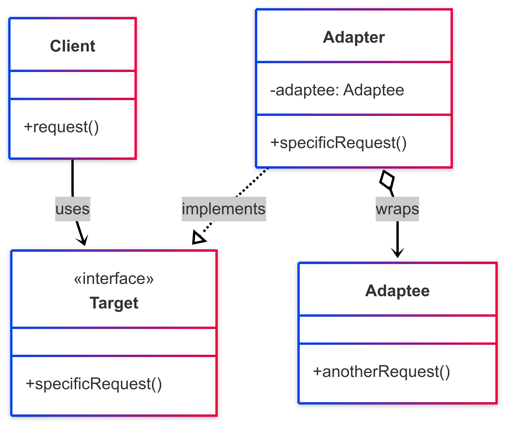
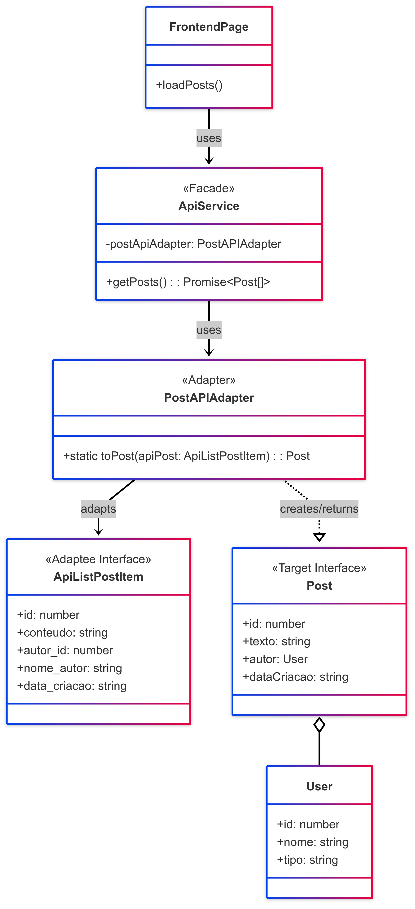

# Adapter

## 1. Introdução ao Padrão Adapter

O padrão Adapter, também conhecido como Wrapper, é um padrão de projeto **estrutural** que permite que interfaces incompatíveis trabalhem juntas. Ele atua como uma ponte entre duas interfaces, convertendo a interface de uma classe (o Adaptee) em outra interface que o cliente (o Target) espera.<sup>1</sup>

Este padrão é particularmente útil quando se deseja reutilizar uma classe existente que não possui a interface adequada para o sistema atual ou quando se está integrando componentes de terceiros.

###  1.1. Problema que o Adapter Resolve

Imagine que você tem um componente no seu sistema que espera uma interface específica para funcionar. No entanto, você encontra uma classe ou serviço externo (ou legado) que oferece a funcionalidade desejada, mas com uma interface diferente. Reescrever o componente existente para se adequar à nova interface pode ser custoso ou impraticável, assim como modificar a classe externa.

O Adapter resolve esse problema criando uma camada intermediária que "traduz" as chamadas da interface esperada pelo cliente para as chamadas da interface da classe existente.

### 1.2. Estrutura e Participantes

O padrão Adapter geralmente envolve os seguintes participantes:

- **Target (Alvo)**: Define a interface específica do domínio que o `Client` usa. É a interface que o cliente espera.
- **Client (Cliente)**: Colabora com objetos que estão em conformidade com a interface `Target`.
- **Adaptee (Adaptado)**: Define uma interface existente que precisa ser adaptada. É a classe ou objeto com a interface incompatível.
- **Adapter (Adaptador)**: Adapta a interface do `Adaptee` à interface do `Target`. Ele implementa a interface `Target` e internamente faz chamadas aos métodos do `Adaptee`.

### 1.3. Tipos de Adapter

Existem duas formas principais de implementar o padrão Adapter:

#### Adapter de Objeto (Object Adapter):

- Utiliza a **composição**. O Adapter contém uma instância do Adaptee.
- As chamadas do Target são delegadas ao objeto Adaptee.
- Permite adaptar uma classe e todas as suas subclasses.
- É a forma mais comum em linguagens que não suportam herança múltipla de classes de forma robusta, como JavaScript/TypeScript.

#### Adapter de Classe (Class Adapter):

- Utiliza **herança múltipla** (ou herança de interface e implementação). O Adapter herda tanto da interface do Target quanto da classe do Adaptee.
- Menos comum em linguagens como Java ou JavaScript/TypeScript devido às limitações de herança múltipla de classes.

> Neste documento, focaremos no Adapter de Objeto, que é o mais relevante para o contexto de desenvolvimento com TypeScript/JavaScript.

### 1.4. Diagrama UML  (Adapter de Objeto)

Abaixo, na Figura 1, um diagrama UML representando a estrutura do Adapter de Objeto:

<font size="3"><p style="text-align: center"><b>Figura 1:</b> Representação UML do Adapter de Objeto</p></font>
<center>



</center>

<font size="3"><p style="text-align: center"><b>Autor</b>: [Rafael Pereira](https://github.com/rafgpereira), 2025.</p></font>


#### Explicação do Diagrama:

- O `Client` interage com a interface `Target`.
- O `Adapter` implementa a interface `Target`.
- O `Adapter` "envolve" (compõe) uma instância do Adaptee.
- Quando o `Client` chama `specificRequest()` no `Adapter`, o `Adapter` internamente chama `anotherRequest()` (ou um método equivalente) no objeto `Adaptee`, possivelmente transformando os parâmetros e o resultado.

### 1.5. Como Funciona

- **1.** O Cliente faz uma chamada a um método na interface do Target, através do objeto Adapter.
- **2.** O Adapter recebe a chamada e a traduz para uma ou mais chamadas aos métodos do objeto Adaptee.
- **3.** O Adaptee executa a funcionalidade.
- **4.** O Adapter pode precisar converter o resultado retornado pelo Adaptee de volta para um formato esperado pela interface Target antes de retorná-lo ao Cliente.


### 1.6. Benefícios

- **Reutilização de Código:** Permite usar classes existentes com interfaces incompatíveis sem modificar seu código original.
- **Flexibilidade:** Desacopla o cliente da implementação concreta do Adaptee. É possível introduzir novos Adapters para diferentes Adaptees sem alterar o cliente, desde que eles implementem a mesma interface Target.
- **Integração Limpa:** Facilita a integração de componentes de terceiros ou sistemas legados.

### 1.7. Desvantagens

- **Aumento da Complexidade:** Adiciona uma camada extra de indireção ao sistema, o que pode, em alguns casos, aumentar a complexidade do código.
- **Overhead de Desempenho:** A tradução de chamadas pode introduzir um pequeno overhead de desempenho, embora geralmente seja insignificante.

---

## 2. Aplicações do Padrão Adapter no Projeto

Agora, detalharemos as implementações específicas do padrão Adapter no projeto do Planetário Virtual.


### 2.1. Adapter no Frontend do Fórum: Comunicação com a API


> 1. **Link da aplicação (deploy):** [Fórum Planetário Virtual](linkdodeploy)
>
> 2. **Link da pasta do frontend (Next.js):** [Frontend Fórum](https://github.com/UnBArqDsw2025-1-Turma02/2025.1-T02-_G7_PlanetarioVirtual_Entrega_03/tree/main/projeto/grupo1/frontend)
>
> 3. **Link da implementação do Adapter:** [Código do Adapter](https://github.com/UnBArqDsw2025-1-Turma02/2025.1-T02-_G7_PlanetarioVirtual_Entrega_03/blob/main/projeto/grupo1/frontend/src/services/apiAdapters.ts)

No frontend do Fórum Planetário Virtual, desenvolvido com Next.js e TypeScript, o padrão Adapter foi crucial para desacoplar a lógica da interface do usuário (UI) das especificidades da API backend.

#### 2.1.1. Contexto do Problema

O backend da aplicação expõe uma API REST com seus próprios formatos de dados para entidades como Postagem e Comentário. Por outro lado, o frontend possui seus próprios tipos TypeScript (Post, Comment) que são otimizados para a renderização e manipulação de estado nos componentes React.Esses formatos diferem em nomes de campos, estrutura de objetos aninhados ou tipos de dados (ex: a API retorna um autor_id, enquanto o frontend espera um objeto autor completo).

#### 2.1.2. Solução com Adapter

Para resolver essa incompatibilidade, foi criada uma camada de adaptadores no arquivo [_src/services/apiAdapters.ts_](https://github.com/UnBArqDsw2025-1-Turma02/2025.1-T02-_G7_PlanetarioVirtual_Entrega_03/blob/main/projeto/grupo1/frontend/src/services/apiAdapters.ts). Esses adaptadores são responsáveis por converter os dados brutos recebidos da API para os tipos de dados que o restante do frontend espera. O arquivo [_src/services/api.ts_](https://github.com/UnBArqDsw2025-1-Turma02/2025.1-T02-_G7_PlanetarioVirtual_Entrega_03/blob/main/projeto/grupo1/frontend/src/services/api.ts), que atua como uma [Fachada](linkFacade) para as chamadas de API, utiliza esses adaptadores após receber a resposta do backend.

#### 2.1.3. Exemplo: Adaptando Dados de Postagem

Vamos analisar como o [_PostAPIAdapter_](https://github.com/UnBArqDsw2025-1-Turma02/2025.1-T02-_G7_PlanetarioVirtual_Entrega_03/blob/main/projeto/grupo1/frontend/src/services/apiAdapters.ts) transforma os dados de uma postagem recebidos da API.

#### a) Dados da API (Adaptee - formato incompatível):

A API, ao listar postagens (GET /api/postagens/), retorna um array de objetos com a seguinte estrutura:

``` typescript
// Tipo que representa o dado vindo da API (Adaptee)
// src/services/api.ts
export type ApiListPostItem = {
  id: number;
  conteudo: string;    // API usa 'conteudo'
  autor_id: number;    // API envia ID do autor
  nome_autor: string;  // API envia nome do autor separado
  data_criacao: string;
};
```


#### b) Dados Esperados pelo Frontend (Target - interface esperada):

O frontend espera um objeto `Post` com a seguinte estrutura:

``` typescript
// Tipo esperado pelo frontend (Target)
// src/services/api.ts
export type User = {
  id: number;
  nome: string;
  tipo: 'comum' | 'moderador';
};

export type Post = {
  id: number;
  texto: string;       // Frontend usa 'texto'
  autor: User;         // Frontend espera um objeto User completo
  dataCriacao: string; // Frontend usa 'dataCriacao' (camelCase)
};
```

#### c) O Adapter em Ação (`PostAPIAdapter`):

O `PostAPIAdapter` no arquivo _src/services/apiAdapters.ts_ implementa a lógica de conversão:

``` typescript
// src/services/apiAdapters.ts
import { initialUsers } from './api'; // Importando para a função findOrCreateUser
import type { User, Post, ApiListPostItem, ApiCreatedPostResponse } from './api'; // Tipos necessários

// Função auxiliar para encontrar ou criar um objeto User
function findOrCreateUser(apiAutorId: number, apiNomeAutor?: string, defaultTipo: 'comum' | 'moderador' = 'comum'): User {
  let user = initialUsers.find(u => u.id === apiAutorId);
  if (!user) {
    user = {
      id: apiAutorId,
      nome: apiNomeAutor || "Autor Desconhecido",
      tipo: defaultTipo
    };
  }
  return user;
}

export class PostAPIAdapter {
  static toPost(apiPost: ApiListPostItem): Post {
    const autorObjeto: User = findOrCreateUser(apiPost.autor_id, apiPost.nome_autor);
    return {
      id: apiPost.id,
      texto: apiPost.conteudo,
      autor: autorObjeto,
      dataCriacao: new Date(apiPost.data_criacao).toISOString(),
    };
  }

  static toCreatedPost(apiPost: ApiCreatedPostResponse): Post {
    const autor = findOrCreateUser(apiPost.autor_id, apiPost.nome_autor);
    return {
      id: apiPost.id,
      texto: apiPost.conteudo,
      autor: autor,
      dataCriacao: new Date(apiPost.data_criacao).toISOString(),
    };
  }
}
```


#### d) Utilização no Serviço da API:

O serviço getPosts em _src/services/api.ts_ utiliza este adapter:

``` typescript

// src/services/api.ts
import { PostAPIAdapter } from './apiAdapters';
// Assume que API_BASE_URL, ApiListPostItem e Post estão definidos no mesmo arquivo ou importados
// ...

export const getPosts = async (): Promise<Post[]> => {
  const API_BASE_URL = process.env.NEXT_PUBLIC_API_URL || '[http://127.0.0.1:8000](http://127.0.0.1:8000)'; // Exemplo
  const endpoint = `${API_BASE_URL}/api/postagens/`;
  try {
    const response = await fetch(endpoint);
    if (!response.ok) {
      throw new Error(`Erro ${response.status} ao buscar postagens`);
    }
    const apiPosts: ApiListPostItem[] = await response.json();
    return apiPosts.map(PostAPIAdapter.toPost);
  } catch (error) {
    console.error("Frontend: Falha crítica ao buscar postagens.", error);
    if (error instanceof Error) throw error;
    throw new Error("Não foi possível conectar à API de postagens.");
  }
};

```


#### 2.1.4. Diagrama UML da Aplicação no Frontend:

Abaixo, na Figura 2, é apresentado o diagrama de classes do Adapter desenvolvido no frontend do fórum.

<font size="3"><p style="text-align: center"><b>Figura 2:</b> Representação UML do Adapter do Frontend do Fórum</p></font>
<center>



</center>

<font size="3"><p style="text-align: center"><b>Autor</b>: [Rafael Pereira](https://github.com/rafgpereira), 2025.</p></font>

#### Explicação do Diagrama:

- `FrontendPage` é o cliente que deseja obter uma lista de `Post`.
- `ApiService` (api.ts) atua como uma [Fachada](linkfacade) e é o cliente direto do `PostAPIAdapter`. Ele chama `PostAPIAdapter.toPost()`.
- `PostAPIAdapter` é o Adapter. Seu método `toPost` recebe um `ApiListPostItem` (a representação dos dados do Adaptee) e retorna um objeto `Post` (o Target).
- `ApiListPostItem` representa a estrutura de dados vinda da API (o Adaptee).
- `Post` representa a estrutura de dados esperada pelo frontend (o Target).

2.1.5. Benefícios Obtidos

- **Desacoplamento:** O frontend não precisa saber os detalhes da estrutura de dados da API. Se a API mudar (ex: `conteudo` virar `descricao_post`), apenas o `PostAPIAdapter` precisa ser atualizado.
- **Consistência Interna:** O frontend trabalha consistentemente com seus próprios tipos (`Post`, `Comment`), tornando o código dos componentes mais limpo e previsível.
- **Manutenibilidade:** A lógica de transformação de dados está centralizada nos adaptadores, facilitando a manutenção e o entendimento.

---

### 2.2. Adapter no ...


Adiciona aqui joão pedro, tenta seguir a estrutura do exemplo acima.


---

## Referências Bibliográficas

> 1. GAMMA, E.; HELM, R.; JOHNSON, R.; VLISSIDES, J. Design Patterns: Elements of Reusable Object-Oriented Software. Reading, MA: Addison-Wesley, 1995.
>
> 2. FREEMAN, E.; ROBSON, E.; BATES, B.; SIERRA, K. Head First Design Patterns. Sebastopol, CA: O'Reilly Media, 2004.
>
> 3. REFACTORING GURU. Adapter Pattern. Refactoring Guru, [s.d.]. Disponível em: https://refactoring.guru/design-patterns/adapter. Acesso em: 30 mai. 2025.


## Histórico de Versões

| Versão | Data       | Descrição                                      | Autor               | Revisor            |
|--------|------------|------------------------------------------------|---------------------|--------------------|
| 1.0    | 30/06/2025 | Criação do documento com a introdução do adapter | [Rafael Pereira](https://github.com/rafgpereira)  | [Joao Pedro](https://github.com/joaopedrooss)          | 
| 1.1    | 01/06/2025 | Adição da aplicação do adapter no frontend do fórum | [Rafael Pereira](https://github.com/rafgpereira)         | [João Pedro](https://github.com/joaopedrooss)    |
