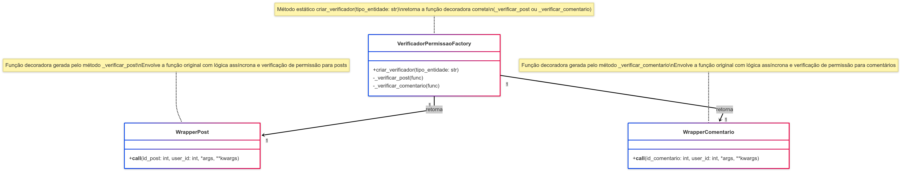

# Decorator

## 1. Introdução ao Padrão Decorator

O padrão de projeto **Decorator** é um padrão estrutural que permite adicionar funcionalidades a objetos de forma dinâmica, sem modificar sua estrutura original. Ele fornece uma alternativa flexível à herança para estender comportamentos de objetos em tempo de execução.

Em vez de alterar diretamente o código da função ou classe, o Decorator envolve o objeto-alvo com um novo objeto que adiciona o comportamento desejado.

### 1.1. Problema que o Decorator Resolve

Durante o desenvolvimento de sistemas, é comum que determinados comportamentos precisem ser adicionados a funções ou métodos de forma modular e reutilizável — por exemplo, verificação de permissão, autenticação, logging, etc.

O padrão Decorator resolve os seguintes problemas:

* **Adição Dinâmica de Comportamento**: Permite modificar o comportamento de métodos ou funções sem alterar seu código-fonte.
* **Alta Reutilização**: Comportamentos adicionais podem ser aplicados em diferentes funções ou classes de forma reutilizável.
* **Separação de Responsabilidades**: A lógica de negócio e a lógica auxiliar (como verificação de permissão) ficam separadas, tornando o código mais limpo.

### 1.2. Estrutura e Participantes

Os principais participantes do padrão Decorator são:

* **Componente**:
  A interface comum que define as operações que podem ser decoradas.
  **No código**: A função de exclusão de post ou comentário.

* **Componente Concreto**:
  Implementação original da funcionalidade.
  **No código**: A função `delete_post`

* **Decorator**:
  Abstração que mantém uma referência ao componente e define a interface compatível com o componente.
  **No código**: As funções decoradoras `_verificar_post` e `_verificar_comentario`.

* **Decorador Concreto**:
  Adiciona funcionalidades ao componente concreto.
  **No código**: A lógica de verificação dentro das funções `_verificar_post` e `_verificar_comentario`.

### 1.3. Diagrama UML (Decorator)

**Figura 1**: Representação UML do Padrão Decorator (Clássico)

<center>



</center>

<font size="3"><p style="text-align: center"><b>Autores</b>: [Milena Rocha](https://github.com/milenafrocha), [Rafael Pereira](https://github.com/rafgpereira), [Letícia Mrtins](https://github.com/leticiatmartins), 2025.</p></font>

### 1.4. Como Funciona

1. O código chama a função decorada.
2. O decorator intercepta a chamada e adiciona seu comportamento extra.
3. O decorator decide se deve ou não permitir que a função original seja executada.
4. Caso permitido, a função original é executada.
5. O resultado da execução (ou a exceção) é retornado ao para funcionar no endpoint.

---

## 2. Aplicação do Padrão Decorator no Projeto

No projeto, usamos decoradores para aplicar **verificação de permissão** antes que uma função seja executada. Esse comportamento é aplicado dinamicamente às rotas responsáveis por excluir posts ou comentários.

**Localização**: [projeto/grupo1/backend/app/decorators/auth_decorator.py](https://github.com/UnBArqDsw2025-1-Turma02/2025.1-T02-_G7_PlanetarioVirtual_Entrega_03/blob/main/projeto/grupo1/backend/app/decorators/auth_decorator.py)

### 2.1. Funções Decoradoras de Verificação

As funções `_verificar_post` e `_verificar_comentario` atuam como decoradores que encapsulam a lógica de permissão.

#### a) Código da Função Decoradora

```python
from functools import wraps
from fastapi import HTTPException
from app.services import forum_service, post_service, comentario_service

class VerificadorPermissaoFactory:
    @staticmethod
    def criar_verificador(tipo_entidade: str):
        if tipo_entidade == "post":
            return VerificadorPermissaoFactory._verificar_post
        elif tipo_entidade == "comentario":
            return VerificadorPermissaoFactory._verificar_comentario
        else:
            raise ValueError("Tipo de entidade inválido para verificação de permissão.")

    @staticmethod
    def _verificar_post(func):
        @wraps(func)
        async def wrapper(id_post: int, user_id: int, *args, **kwargs):
            user = forum_service.get_user_by_id(user_id)
            if not user:
                raise HTTPException(status_code=404, detail="Usuário não encontrado.")
            if user.tipo == "moderador":
                return await func(id_post=id_post, user_id=user_id, *args, **kwargs)
            post = post_service.get_post_by_id(id_post)
            if not post:
                raise HTTPException(status_code=404, detail="Postagem não encontrada.")
            if post.autor_id == user.id:
                return await func(id_post=id_post, user_id=user_id, *args, **kwargs)
            raise HTTPException(status_code=403, detail="Apenas o autor ou moderador pode excluir esta postagem.")
        return wrapper
```

### 2.2. Exemplo de Uso do Decorator em Endpoint

```python
from fastapi import APIRouter, Depends
from app.auth import get_current_user_id
from app.decorators.factory.verificador_factory import VerificadorPermissaoFactory

router = APIRouter()
verificador_permissao_post = VerificadorPermissaoFactory.criar_verificador("post")

@router.delete("/posts/{id_post}", summary="Deletar uma postagem")
@verificador_permissao_post
async def deletar_post_endpoint(id_post: int, current_user_id: int = Depends(get_current_user_id)):
    """
    Deleta uma postagem.
    A permissão é verificada pelo decorador @verificador_permissao_post.
    """
    # Se chegou aqui, a permissão foi concedida
    # Lógica para deletar o post
```

### 2.3. Vantagens no Projeto

* **Reutilização**: A lógica de verificação pode ser aplicada a múltiplos endpoints.
* **Separação de Responsabilidades**: A verificação de permissão é desacoplada da lógica principal.
* **Manutenção Simples**: Alterações na lógica de permissão afetam apenas o decorador.

---

## 3. Benefícios

* Modularidade
* Reutilização de código
* Separação clara entre lógica principal e lógica adicional
* Extensibilidade

## 4. Desvantagens

* Pode aumentar a complexidade se houver muitos decoradores aninhados
* Depuração pode ser mais difícil (stack trace com múltiplos wrappers)

---

## Referências Bibliográficas

> 1. REFACTORING GURU. Decorator Pattern. Refactoring Guru, \[s.d.]. Disponível em: [https://refactoring.guru/design-patterns/decorator](https://refactoring.guru/design-patterns/decorator). Acesso em: 30 mai. 2025.
>
> 2. GAMMA, E.; HELM, R.; JOHNSON, R.; VLISSIDES, J. *Design Patterns: Elements of Reusable Object-Oriented Software*. Reading, MA: Addison-Wesley, 1995.
>
> 3. CIPRIANI, Felipe. Decorator: saiba quando usar este padrão de projeto e veja um exemplo prático. Tech Writers, Softplan, 20 dez. 2021. Disponível em: https://www.softplan.com.br/en/tech-writers/padrao-de-projeto-decorator/. Acesso em: 1 jun. 2025.

---

## Histórico de Versões

| Versão | Data       | Descrição                                                   | Autor                                                                                                                                                   | Revisor                                       |
| ------ | ---------- | ----------------------------------------------------------- | ------------------------------------------------------------------------------------------------------------------------------------------------------- | --------------------------------------------- |
| 1.0    | 01/06/2025 | Criação do documento com a explicação do padrão Decorator   | [Milena Rocha](https://github.com/milenafrocha)                                                                   | [Joao Pedro](https://github.com/joaopedrooss) |
| 1.1    | 01/06/2025 | Adição de exemplos e explicação detalhada do uso no projeto | [Milena Rocha](https://github.com/milenafrocha), [Rafael Pereira](https://github.com/rafgpereira), [Letícia Mrtins](https://github.com/leticiatmartins) | [Joao Pedro](https://github.com/joaopedrooss) |

---

