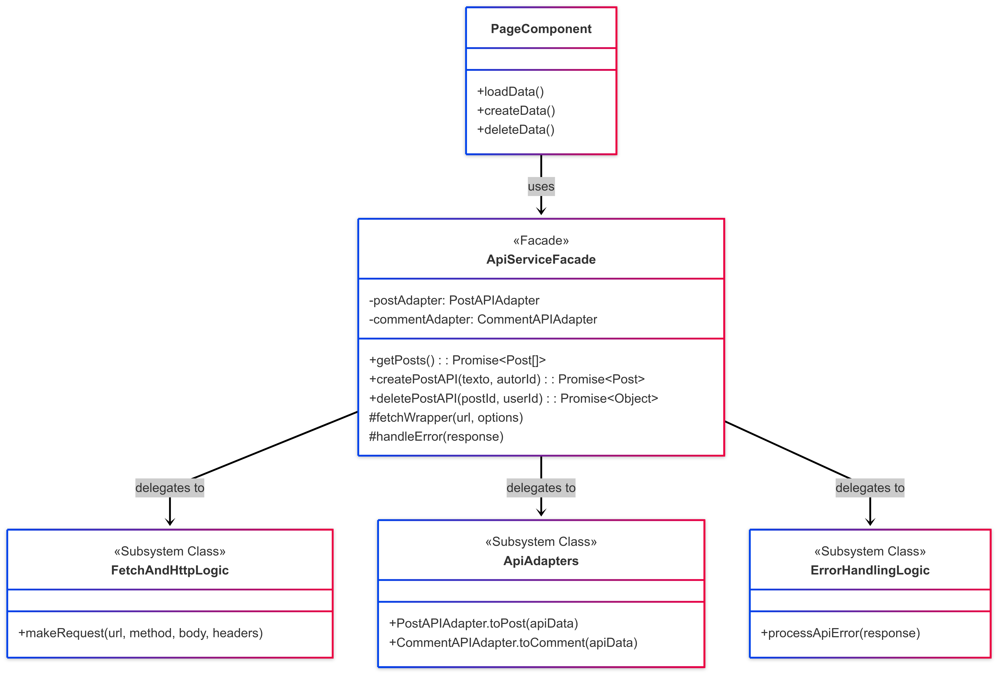

# Facade

## 1. Introdução ao Padrão Facade

O padrão Facade é um padrão de projeto **estrutural** que fornece uma interface simplificada e unificada para um conjunto complexo de interfaces em um subsistema. Em vez de expor toda a complexidade interna de um sistema ou de vários subsistemas, o Facade oferece um ponto de entrada único e de mais alto nível, tornando o subsistema mais fácil de usar.<sup>1</sup>

O nome "Facade" (fachada, em português) sugere sua função: ele é a "face" externa de um sistema que esconde sua complexidade interna.

### 1.1. Problema que o Facade Resolve

Sistemas complexos são frequentemente compostos por múltiplas classes e objetos interdependentes. Para realizar uma tarefa comum, um cliente pode precisar interagir com vários desses objetos, entendendo suas responsabilidades e a ordem correta das interações. Isso pode levar a um alto acoplamento entre o cliente e o subsistema, tornando o código do cliente difícil de escrever, entender e manter.

Além disso, se a estrutura interna do subsistema mudar, o código do cliente que depende diretamente de seus componentes internos também precisará ser modificado.

O Facade resolve esses problemas oferecendo uma interface simples que delega as requisições do cliente para os objetos apropriados dentro do subsistema.

### 1.2. Estrutura e Participantes

O padrão Facade geralmente envolve os seguintes participantes:

* **Facade (Fachada):**
    * Sabe quais classes do subsistema são responsáveis por atender a uma requisição.
    * Delega as requisições do cliente para os objetos apropriados do subsistema.
    * Não adiciona nenhuma funcionalidade nova, apenas compõe as funcionalidades existentes de forma simplificada.
* **Subsystem Classes (Classes do Subsistema):**
    * Implementam a funcionalidade do subsistema.
    * Manipulam o trabalho designado pelo objeto Facade.
    * Não têm conhecimento da existência do Facade; ou seja, podem ser usadas diretamente se necessário, mas o Facade oferece uma forma mais simples de usá-las para tarefas comuns.
* **Client (Cliente):**
    * Usa o Facade para interagir com o subsistema, em vez de interagir diretamente com suas classes internas.

### 1.3. Diagrama UML


Abaixo, na Figura 1, um diagrama UML representando a estrutura padrão do Facade:

<font size="3"><p style="text-align: center"><b>Figura 1:</b> Representação UML do Facade</p></font>
<center>


</center>

<font size="3"><p style="text-align: center"><b>Autor</b>: [Rafael Pereira](https://github.com/rafgpereira), 2025.</p></font>


#### Explicação do Diagrama:

- O `Client` interage apenas com o `Facade`.
- O `Facade` possui referências (ou instancia) as classes do subsistema (SubsystemPartA, SubsystemPartB, SubsystemPartC).
- Quando o `Client` chama uma operação no `Facade` (ex: `operation1()`), o `Facade` coordena as chamadas necessárias aos métodos das classes do subsistema (ex: `doSomethingA()`, `doSomethingB()`) para realizar a tarefa.

### 1.4. Como Funciona

- 1. O Cliente precisa realizar uma operação que envolve múltiplas partes de um subsistema complexo.
- 2. Em vez de interagir diretamente com todas essas partes, o Cliente chama um método simples no objeto Facade.
- 3. O Facade, que conhece a estrutura interna do subsistema, delega essa chamada para as classes apropriadas do subsistema, na ordem correta e com os parâmetros necessários.
- 4. As classes do subsistema executam suas tarefas.
- 5. O Facade pode agregar ou processar os resultados das classes do subsistema antes de retornar uma resposta ao Cliente.

### 1.5. Benefícios

- **Simplificação:** Fornece uma interface mais simples para um subsistema complexo, tornando-o mais fácil de usar.
- **Desacoplamento:** Reduz o acoplamento entre o cliente e as classes internas do subsistema. Mudanças no subsistema (desde que a interface do Facade permaneça a mesma) têm menos probabilidade de afetar os clientes.
- **Organização em Camadas:** Ajuda a organizar o sistema em camadas, com o Facade servindo como ponto de entrada para uma camada de serviço ou lógica de negócios.
- **Melhora a Legibilidade e Manutenibilidade:** O código do cliente se torna mais limpo e focado em suas responsabilidades, pois a complexidade da interação com o subsistema é encapsulada pelo Facade.

### 1.6. Desvantagens

- **Pode se tornar um "God Object":** Se o Facade tentar simplificar demais um subsistema muito grande ou assumir muitas responsabilidades, ele pode se tornar um objeto muito grande e complexo (um anti-padrão conhecido como "God Object" ou "God Class").
- **Não impede o acesso ao subsistema:** O Facade oferece uma interface simplificada, mas geralmente não impede que os clientes acessem as classes do subsistema diretamente se precisarem de funcionalidades mais granulares não expostas pelo Facade.
- **Abstração Excessiva:** Em alguns casos, a simplificação pode ocultar detalhes importantes do subsistema que o cliente poderia precisar conhecer.

## 2. Aplicações do Padrão Facade no Projeto

Nesta seção, detalharemos a implementação do Facade dentro dos projetos desenvolvidos.


## 2.1. Facade no Frontend do Fórum: Simplificando a Interação com a API (src/services/api.ts)

> 1. **Link da aplicação (deploy):** [Fórum Planetário Virtual](https://2025-1-t02-g7-planetario-virtual-en.vercel.app/)
>
> 2. **Link da pasta do frontend (código):** [Frontend Fórum](https://github.com/UnBArqDsw2025-1-Turma02/2025.1-T02-_G7_PlanetarioVirtual_Entrega_03/tree/main/projeto/grupo1/frontend)
>
> 3. **Link da implementação do Facade:** [Código - Facade](https://github.com/UnBArqDsw2025-1-Turma02/2025.1-T02-_G7_PlanetarioVirtual_Entrega_03/blob/main/projeto/grupo1/frontend/src/services/api.ts)


No frontend do Fórum Planetário Virtual, o arquivo [_src/services/api.ts_](https://github.com/UnBArqDsw2025-1-Turma02/2025.1-T02-_G7_PlanetarioVirtual_Entrega_03/blob/main/projeto/grupo1/frontend/src/services/api.ts) atua como uma **Fachada** (Facade) para todas as interações com a [API backend](https://two025-1-t02-g7-planetariovirtual.onrender.com/docs) e a lógica de transformação de dados.

### 2.1.1. Contexto do Problema

Os componentes da interface do usuário (UI), como as páginas (`HomePage`, `MeuPerfilPage`, `PostDetailPage`), precisam buscar dados do backend, enviar novos dados (criar postagens, comentários) e solicitar exclusões. Essas operações envolvem:

 - **1.** Construir a `URL` correta do endpoint da API.
 - **2.** Configurar a chamada `fetch` com o método HTTP apropriado (GET, POST, DELETE).
 - **3.** Adicionar cabeçalhos (como `Content-Type` ou o `X-User-ID` para autorização).
 - **4.** Converter o corpo da requisição para JSON (para POST).
 - **5.** Fazer a chamada `fetch` de forma assíncrona.
 - **6.** Verificar se a resposta da API foi bem-sucedida (`response.ok`).
 - **7.** Extrair e converter os dados da resposta (ex: `response.json()`).
 - **8.** Aplicar Adaptadores (do padrão Adapter, como visto em `apiAdapters.ts`) para transformar os dados da API no formato esperado pelo frontend.
 - **9.** Lidar com erros de rede ou da API.

Realizar todas essas etapas diretamente em cada componente que precisa acessar a API tornaria o código dos componentes muito verboso, repetitivo e acoplado aos detalhes da implementação da comunicação com a API, o que não queremos em nenhuma hipótese.


#### Os componentes que utilizam o Facade ([_api.ts_](https://github.com/UnBArqDsw2025-1-Turma02/2025.1-T02-_G7_PlanetarioVirtual_Entrega_03/blob/main/projeto/grupo1/frontend/src/services/api.ts)):

- [_HomePage_](https://github.com/UnBArqDsw2025-1-Turma02/2025.1-T02-_G7_PlanetarioVirtual_Entrega_03/blob/main/projeto/grupo1/frontend/src/app/(main)/page.tsx)
- [_MeuPerfilPage_](https://github.com/UnBArqDsw2025-1-Turma02/2025.1-T02-_G7_PlanetarioVirtual_Entrega_03/blob/main/projeto/grupo1/frontend/src/app/(main)/meu-perfil/page.tsx)
- [_PostDetailPage_](https://github.com/UnBArqDsw2025-1-Turma02/2025.1-T02-_G7_PlanetarioVirtual_Entrega_03/blob/main/projeto/grupo1/frontend/src/app/(main)/postagens/%5Bid%5D/page.tsx)
- [_UsuariosPage_](https://github.com/UnBArqDsw2025-1-Turma02/2025.1-T02-_G7_PlanetarioVirtual_Entrega_03/blob/main/projeto/grupo1/frontend/src/app/(main)/usuarios/page.tsx)
- [_PostDetailView_](https://github.com/UnBArqDsw2025-1-Turma02/2025.1-T02-_G7_PlanetarioVirtual_Entrega_03/blob/main/projeto/grupo1/frontend/src/components/forum/PostDetailView.tsx)

### 2.1.3. Exemplo: Buscando Postagens

Existem diversos exemplos de uso do **Facade** dentro do projeto do Frontend do Fórum, que estão listados acima. Em todas as páginas que são feitas chamadas à API, utiliza-se o `api.ts` como **Fachada** que externaliza apenas os métodos relevantes para as páginas e internaliza toda a lógica da requisição. 


Abaixo, veremos sua aplicação para um exemplo, o de buscar postagens, através do método `getPosts()` no componente `HomePage`

### a) O Cliente (Componente da Página):

Um componente de página, como a [_HomePage_](https://github.com/UnBArqDsw2025-1-Turma02/2025.1-T02-_G7_PlanetarioVirtual_Entrega_03/blob/main/projeto/grupo1/frontend/src/app/(main)/page.tsx), precisa listar as postagens. Ele usa o ApiService (a fachada [_api.ts_](https://github.com/UnBArqDsw2025-1-Turma02/2025.1-T02-_G7_PlanetarioVirtual_Entrega_03/blob/main/projeto/grupo1/frontend/src/services/api.ts)) de forma simples:

```javascript
import { getPosts } from '@/services/api'; // Importa a função da Fachada
// ...

const carregarPostagens = async () => {
  // ... (lógica de setIsLoading, setErrorMessage) ...
  try {
    // Chama o método simples da Fachada
    const postagensRecebidas = await getPosts(); 
    setPosts(postagensRecebidas.sort(/*...*/));
    // ... lógica de toast ...
  } catch (erro) {
    // ... tratamento de erro ...
  } finally {
    // ... (setIsLoading(false)) ...
  }
};

useEffect(() => {
  carregarPostagens();
}, []);
```
O componente `HomePage` não precisa saber como `getPosts` é implementado, apenas que ele retorna uma `Promise<Post[]>`.

### b) A Fachada em Ação (`api.ts`):

Dentro do [_src/services/api.ts_](https://github.com/UnBArqDsw2025-1-Turma02/2025.1-T02-_G7_PlanetarioVirtual_Entrega_03/blob/main/projeto/grupo1/frontend/src/services/api.ts), a função `getPosts` lida com a complexidade:

```javascript
// src/services/api.ts (Fachada)
import { PostAPIAdapter } from './apiAdapters'; // Parte do subsistema
import type { Post, ApiListPostItem } from './api'; // Tipos

const API_BASE_URL = process.env.NEXT_PUBLIC_API_URL || 'http://127.0.0.1:8000';

export const getPosts = async (): Promise<Post[]> => {
  const endpoint = `${API_BASE_URL}/api/postagens/`; // 1. Construção da URL
  try {
    const response = await fetch(endpoint); // 2. Chamada fetch (GET por padrão)
    
    // 3. Verificação da resposta
    if (!response.ok) {
      const errorData = await response.text();
      throw new Error(`Erro ${response.status} ao buscar postagens: ${errorData}`);
    }
    
    // 4. Extração e conversão JSON
    const apiPosts: ApiListPostItem[] = await response.json();
    
    // 5. Uso do Adapter para transformar os dados
    return apiPosts.map(PostAPIAdapter.toPost); 
  } catch (error) {
    // 6. Tratamento de erro
    console.error("Frontend: Falha crítica ao buscar postagens.", error);
    if (error instanceof Error) throw error;
    throw new Error("Não foi possível conectar à API de postagens.");
  }
};
```

O `api.ts` 'esconde' do `HomePage` as etapas de construção de URL, `fetch`, checagem de erro, parsing de JSON e a chamada ao `PostAPIAdapter`.


### 2.1.4. Diagrama UML da Aplicação no Frontend

Abaixo, na Figura 2, o diagrama de classes que representa a lógica de funcionamento do **Facade** junto à `HomePage`, que foi explorada acima.

<font size="3"><p style="text-align: center"><b>Figura 2:</b> Representação UML do Facade na HomePage</p></font>
<center>



</center>

<font size="3"><p style="text-align: center"><b>Autor</b>: [Rafael Pereira](https://github.com/rafgpereira), 2025.</p></font>

### Explicação do Diagrama:

- `PageComponent` (ex: `HomePage`, `MeuPerfilPage`) é o cliente.
- `ApiServiceFacade` (`api.ts`) é a Fachada que expõe métodos simplificados.
- `FetchAndHttpLogic`, `ApiAdapters` e `ErrorHandlingLogic` representam as classes/lógicas do subsistema que o `ApiServiceFacade` coordena. Essas lógicas estão contidas dentro dos métodos do `api.ts` e no `apiAdapters.ts`.


### 2.1.5. Benefícios Obtidos

- **Componentes Mais Simples:** Os componentes React (páginas) se tornam mais limpos, pois não precisam lidar com a lógica de baixo nível da comunicação com a API. Eles apenas consomem os serviços oferecidos pela fachada.
- **Centralização da Lógica de API:** Toda a lógica de como interagir com a API (endpoints, formatação de dados, tratamento de erros, uso de adaptadores) está centralizada em `api.ts`.
- **Facilidade de Manutenção:** Se um endpoint da API mudar, ou se a forma de autenticação for alterada, ou se a estrutura dos dados da API for modificada (exigindo ajuste nos adaptadores), as mudanças são feitas principalmente em `api.ts` e `apiAdapters.ts`, minimizando o impacto no restante da aplicação.
- **Melhor Testabilidade:** A fachada pode ser mais facilmente mockada durante os testes unitários dos componentes, e o próprio `api.ts` pode ser testado de forma isolada (testando sua interação com a API real ou um mock da API).

---

## Referências Bibliográficas

> 1. GAMMA, E.; HELM, R.; JOHNSON, R.; VLISSIDES, J. Design Patterns: Elements of Reusable Object-Oriented Software. Reading, MA: Addison-Wesley, 1995.
>
> 2. FREEMAN, E.; ROBSON, E.; BATES, B.; SIERRA, K. Head First Design Patterns. Sebastopol, CA: O'Reilly Media, 2004.
>
> 3. REFACTORING GURU. Adapter Pattern. Refactoring Guru, [s.d.]. Disponível em: [https://refactoring.guru/design-patterns/adapter](https://refactoring.guru/design-patterns/adapter). Acesso em: 01 jun. 2025.


## Histórico de Versões

| Versão | Data       | Descrição                                      | Autor               | Revisor            |
|--------|------------|------------------------------------------------|---------------------|--------------------|
| 1.0    | 01/06/2025 | Criação do documento com a introdução do facade | [Rafael Pereira](https://github.com/rafgpereira)  | [Milena Rocha](https://github.com/milenafrocha)          | 
| 1.1    | 01/06/2025 | Adição da aplicação do facade no frontend do fórum | [Rafael Pereira](https://github.com/rafgpereira)      | [Milena Rocha](https://github.com/milenafrocha)    |

