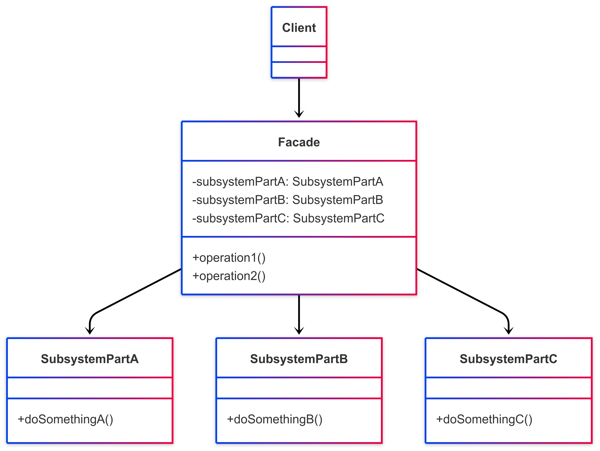

# Facade

## 1. Introdução ao Padrão Facade

O padrão Facade é um padrão de projeto **estrutural** que fornece uma interface simplificada e unificada para um conjunto complexo de interfaces em um subsistema. Em vez de expor toda a complexidade interna de um sistema ou de vários subsistemas, o Facade oferece um ponto de entrada único e de mais alto nível, tornando o subsistema mais fácil de usar.1

O nome "Facade" (fachada, em português) sugere sua função: ele é a "face" externa de um sistema que esconde sua complexidade interna.

### 1.1. Problema que o Facade Resolve

Sistemas complexos são frequentemente compostos por múltiplas classes e objetos interdependentes. Para realizar uma tarefa comum, um cliente pode precisar interagir com vários desses objetos, entendendo suas responsabilidades e a ordem correta das interações. Isso pode levar a um alto acoplamento entre o cliente e o subsistema, tornando o código do cliente difícil de escrever, entender e manter.

Além disso, se a estrutura interna do subsistema mudar, o código do cliente que depende diretamente de seus componentes internos também precisará ser modificado.

O Facade resolve esses problemas oferecendo uma interface simples que delega as requisições do cliente para os objetos apropriados dentro do subsistema.

### 1.2. Estrutura e Participantes

O padrão Facade geralmente envolve os seguintes participantes:

* **Facade (Fachada):**
    * Sabe quais classes do subsistema são responsáveis por atender a uma requisição.
    * Delega as requisições do cliente para os objetos apropriados do subsistema.
    * Não adiciona nenhuma funcionalidade nova, apenas compõe as funcionalidades existentes de forma simplificada.
* **Subsystem Classes (Classes do Subsistema):**
    * Implementam a funcionalidade do subsistema.
    * Manipulam o trabalho designado pelo objeto Facade.
    * Não têm conhecimento da existência do Facade; ou seja, podem ser usadas diretamente se necessário, mas o Facade oferece uma forma mais simples de usá-las para tarefas comuns.
* **Client (Cliente):**
    * Usa o Facade para interagir com o subsistema, em vez de interagir diretamente com suas classes internas.

### 1.3. Diagrama UML

Abaixo, na Figura 1, um diagrama UML representando a estrutura padrão do Facade:

<b>Figura 1:</b> Representação UML do Facade

<b>Autor</b>: [Rafael Pereira](https://github.com/rafgpereira), 2025.

#### Explicação do Diagrama:

- O `Client` interage apenas com o `Facade`.
- O `Facade` possui referências (ou instancia) as classes do subsistema (SubsystemPartA, SubsystemPartB, SubsystemPartC).
- Quando o `Client` chama uma operação no `Facade` (ex: `operation1()`), o `Facade` coordena as chamadas necessárias aos métodos das classes do subsistema (ex: `doSomethingA()`, `doSomethingB()`) para realizar a tarefa.

### 1.4. Como Funciona

- 1. O Cliente precisa realizar uma operação que envolve múltiplas partes de um subsistema complexo.
- 2. Em vez de interagir diretamente com todas essas partes, o Cliente chama um método simples no objeto Facade.
- 3. O Facade, que conhece a estrutura interna do subsistema, delega essa chamada para as classes apropriadas do subsistema, na ordem correta e com os parâmetros necessários.
- 4. As classes do subsistema executam suas tarefas.
- 5. O Facade pode agregar ou processar os resultados das classes do subsistema antes de retornar uma resposta ao Cliente.

### 1.5. Benefícios

- **Simplificação:** Fornece uma interface mais simples para um subsistema complexo, tornando-o mais fácil de usar.
- **Desacoplamento:** Reduz o acoplamento entre o cliente e as classes internas do subsistema. Mudanças no subsistema (desde que a interface do Facade permaneça a mesma) têm menos probabilidade de afetar os clientes.
- **Organização em Camadas:** Ajuda a organizar o sistema em camadas, com o Facade servindo como ponto de entrada para uma camada de serviço ou lógica de negócios.
- **Melhora a Legibilidade e Manutenibilidade:** O código do cliente se torna mais limpo e focado em suas responsabilidades, pois a complexidade da interação com o subsistema é encapsulada pelo Facade.

### 1.6. Desvantagens

- **Pode se tornar um "God Object":** Se o Facade tentar simplificar demais um subsistema muito grande ou assumir muitas responsabilidades, ele pode se tornar um objeto muito grande e complexo (um anti-padrão conhecido como "God Object" ou "God Class").
- **Não impede o acesso ao subsistema:** O Facade oferece uma interface simplificada, mas geralmente não impede que os clientes acessem as classes do subsistema diretamente se precisarem de funcionalidades mais granulares não expostas pelo Facade.
- **Abstração Excessiva:** Em alguns casos, a simplificação pode ocultar detalhes importantes do subsistema que o cliente poderia precisar conhecer.