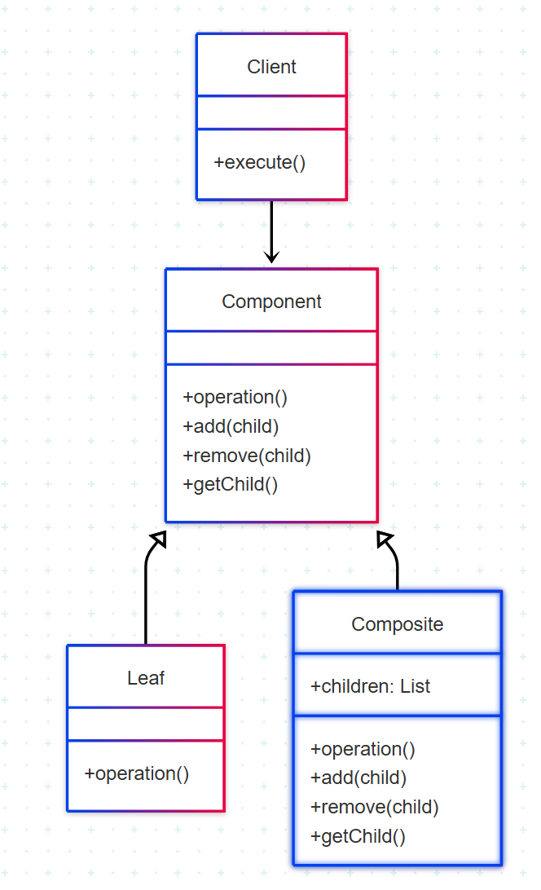

# Composite

## 1. Introdução ao Padrão Composite

O padrão Composite é um padrão de projeto **estrutural** que permite tratar objetos individuais e composições de objetos de maneira uniforme. Ele compõe objetos em estruturas de árvore para representar hierarquias parte-todo, permitindo que os clientes tratem objetos individuais e composições de objetos de forma idêntica.<sup>1</sup>

### 1.1. Problema que o Composite Resolve

Em sistemas onde é necessário manipular hierarquias de objetos complexos (como árvores de componentes), surge o problema de tratar objetos folha (individuais) e objetos compostos (que contêm outros objetos) de forma diferente. Isso leva a verificações constantes de tipo no código cliente, tornando-o complexo e frágil.

O Composite resolve este problema definindo uma interface comum para objetos individuais e compostos, permitindo que o cliente trate ambos uniformemente.

### 1.2. Estrutura e Participantes

O padrão Composite envolve os seguintes participantes:

* **Component (Componente)**:
  - Interface comum para todos os objetos na composição
  - Declara operações que podem ser realizadas por todos os componentes
  - Opcionalmente, define uma interface para acessar e gerenciar filhos

* **Leaf (Folha)**:
  - Representa objetos folha na composição (não têm filhos)
  - Implementa as operações definidas pelo Component

* **Composite (Composto)**:
  - Define o comportamento para componentes que têm filhos
  - Armazena componentes filhos
  - Implementa operações relacionadas aos filhos

* **Client (Cliente)**:
  - Manipula objetos na composição através da interface Component
  - 
### 1.3. Diagrama UML

<font size="3"><p style="text-align: center"><b>Figura 1:</b> Representação UML do Composite</p></font>
<center>



</center>

<font size="3"><p style="text-align: center"><b>Autor</b>: [Raphaela Guimarães], 2025.</p></font>

### 1.4. Como Funciona

1. O cliente interage com a interface Component, sem saber se está lidando com um Leaf ou Composite
2. Para operações que não fazem sentido em Leaf (como adicionar filhos), pode-se lançar exceções ou implementar como no-op
3. O Composite delega operações para seus filhos quando apropriado
4. A estrutura em árvore pode ser percorrida recursivamente

### 1.5. Benefícios

- **Tratamento uniforme**: Objetos individuais e compostos são tratados de forma consistente
- **Flexibilidade**: Nova subclasses de Component podem ser adicionadas facilmente
- **Simplificação**: Código cliente fica mais simples, sem verificações de tipo
- **Hierarquias recursivas**: Permite construir estruturas complexas de forma simples

### 1.6. Desvantagens

- **Generalização excessiva**: Pode tornar o design muito genérico, dificultando a restrição de certas operações
- **Dificuldade de restrição**: Difícil restringir certos componentes a terem apenas tipos específicos de filhos

## 2. Aplicações do Padrão Composite no Projeto

### 2.1. Composite no Sistema de Comentários Hierárquicos

**Contexto**: No fórum do Planetário Virtual, os comentários podem ter respostas, que por sua vez podem ter mais respostas, formando uma estrutura em árvore.

Exemplo em código: 
```java
// Composite
import java.util.ArrayList;
import java.util.List;

public class Postagem implements Publicacao {
    private String titulo;
    private String conteudoPrincipal;
    private String autor;
    private List<Publicacao> publicacoesAninhadas = new ArrayList<>(); // Filhos (ex: comentários)

    public Postagem(String titulo, String conteudoPrincipal, String autor) {
        this.titulo = titulo;
        this.conteudoPrincipal = conteudoPrincipal;
        this.autor = autor;
    }

    @Override
    public void exibir() {
        System.out.println("=== Postagem ===");
        System.out.println("Título: " + titulo + " (Autor: " + autor + ")");
        System.out.println("Conteúdo: " + conteudoPrincipal);
        System.out.println("--- Publicações Aninhadas (" + publicacoesAninhadas.size() + ") ---");
        for (Publicacao pub : publicacoesAninhadas) {
            pub.exibir(); // Delega a exibição para os filhos
        }
        System.out.println("==================");
    }

    @Override
    public String getAutor() {
        return this.autor;
    }

    // Métodos para gerenciar filhos
    @Override
    public void adicionar(Publicacao publicacao) {
        publicacoesAninhadas.add(publicacao);
    }

    @Override
    public void remover(Publicacao publicacao) {
        publicacoesAninhadas.remove(publicacao);
    }

    @Override
    public Publicacao getFilho(int i) {
        return publicacoesAninhadas.get(i);
    }

    public List<Publicacao> getPublicacoesAninhadas() {
        return publicacoesAninhadas;
    }
}
```
**Contexto 2**: Um comentário é uma "folha" na hierarquia, pois geralmente não contém outras publicações.

Exemplo em código:
```java
// Leaf
public class Comentario implements Publicacao {
    private String texto;
    private String autor;
    // Outros atributos específicos de um comentário

    public Comentario(String texto, String autor) {
        this.texto = texto;
        this.autor = autor;
    }

    @Override
    public void exibir() {
        System.out.println("Comentário por: " + autor);
        System.out.println("'" + texto + "'");
        System.out.println("--------------------");
    }

    @Override
    public String getAutor() {
        return this.autor;
    }

    // Implementações de adicionar, remover, getFilho podem ser omitidas
    // se a implementação padrão na interface Publicacao lançar UnsupportedOperationException,
    // ou podem ser sobrescritas para lançar a exceção explicitamente.
}
```


### 2.2. Benefícios Obtidos

- **Manipulação uniforme:** Tanto comentários individuais quanto threads completas são tratados da mesma forma.
- **Extensibilidade:** Fácil adicionar novos tipos de componentes (ex: comentários fixados).
- **Processamento recursivo:** Operações como contagem total de respostas ou renderização são simplificadas.

## Referências Bibliográficas

> 1. GAMMA, E.; HELM, R.; JOHNSON, R.; VLISSIDES, J. Design Patterns: Elements of Reusable Object-Oriented Software. Reading, MA: Addison-Wesley, 1995.
>
> 2. FREEMAN, E.; ROBSON, E.; BATES, B.; SIERRA, K. Head First Design Patterns. Sebastopol, CA: O'Reilly Media, 2004.
>
> 3. REFACTORING GURU. Facade Pattern. Refactoring Guru, [s.d.]. Disponível em: [https://refactoring.guru/design-patterns/facade](https://refactoring.guru/design-patterns/facade). Acesso em: 01 jun. 2025.


## Histórico de Versões

| Versão | Data       | Descrição                                      | Autor               | Revisor            |
|--------|------------|------------------------------------------------|---------------------|--------------------|
| 1.0    | 02/06/2025 | Criação do documento com a introdução do composite | [Raphaela Guimarães](https://github.com/raphaiela)      |  [Taynara Vitorino](https://github.com/taybalau)         | 
| 1.1   | 02/06/2025 | Adição do código | [Antônio Júnior](https://github.com/antonioleaojr)      |  [Taynara Vitorino](https://github.com/taybalau)         | 
