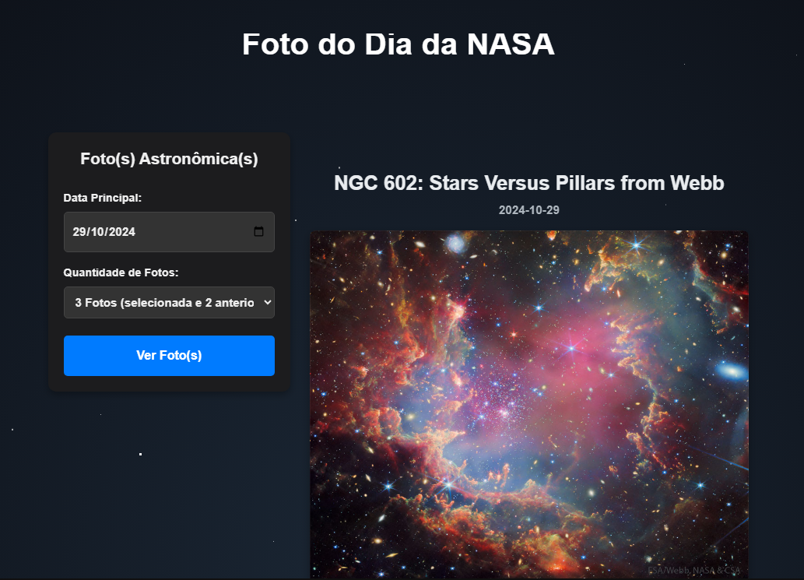

# Adapter

## Introdução

O Adapter é um padrão de design estrutural que permite que classes com interfaces incompatíveis trabalhem juntas. Ele atua como um "tradutor" entre o cliente e um serviço existente, facilitando a integração sem modificar o código original.

Neste contexto, aplicamos o padrão Adapter para integrar a API da NASA (APOD - Astronomy Picture of the Day) ao nosso sistema, permitindo que o cliente consuma os dados da API por meio de uma interface padronizada.

## Elementos Principais do Adapter

### 1. Client (Cliente)
O cliente é responsável por consumir os dados da API da NASA. Ele utiliza a interface fornecida pelo Adapter para obter as informações desejadas.

### 2. Target (Alvo)
Define a interface esperada pelo cliente para interagir com o sistema. Neste caso, é uma função que retorna os dados da foto do dia da NASA.

### 3. Adapter (Adaptador)
Implementa a interface Target e traduz as chamadas do cliente para o formato esperado pela API da NASA. Ele encapsula a lógica de requisição e tratamento de dados da API.

### 4. Adaptee (Adaptado)
É a API da NASA (APOD), que fornece os dados da foto do dia. Sua interface original pode não ser compatível diretamente com o que o cliente espera.

## Vantagens e Justificativas para o Uso do Adapter

- **Desacoplamento**: O cliente não precisa conhecer os detalhes da API da NASA.  
- **Reutilização de Código**: Permite reutilizar o código existente da API sem modificações.  
- **Facilidade de Manutenção**: Alterações na API da NASA requerem mudanças apenas no Adapter, mantendo o cliente intacto.  

## Metodologia

A aplicação foi desenvolvida em JavaScript, utilizando o `fetch` para realizar requisições HTTP à API da NASA. O Adapter encapsula a lógica de requisição e fornece uma interface simples para o cliente consumir os dados.

## Modelagem

### **Implementação**

A implementação do sistema para exibição das fotos astronômicas diárias da NASA (APOD - Astronomy Picture of the Day) foi realizada utilizando JavaScript puro, consumindo a API pública da NASA. O código monta dinamicamente a interface de usuário no HTML, permitindo ao usuário selecionar uma data principal e a quantidade de fotos (1 a 3) para visualizar.

Ao clicar no botão, o sistema valida a data informada, calcula o intervalo de datas a ser consultado, faz uma requisição assíncrona à API da NASA usando fetch, e exibe as imagens ou vídeos retornados ordenados pela data. Todo o feedback ao usuário, incluindo erros e status de carregamento, é tratado diretamente na interface.

#### 1. Adaptee (API da NASA)

A API da NASA fornece os dados da foto do dia no seguinte endpoint: 
https://api.nasa.gov/planetary/apod?api_key=DEMO_KEY

### **Código**

#### 1. **Estrutura Básica do Adapter**

O padrão Adapter é composto por três elementos principais: o Adaptee (serviço original), o Adapter (adaptador) e o Cliente (quem consome a interface adaptada). No contexto do sistema, usamos uma interface base para provedores de fotos astronômicas:

```javascript
class PhotoProvider {
    async getPhotos(startDate, endDate) {
        throw new Error("Método não implementado");
    }
}
```

#### 2. **Adaptee (Serviço Original)**

O Adaptee é a API pública da NASA (APOD), que fornece os dados das fotos astronômicas do dia. Sua interface original é um endpoint HTTP, por exemplo:

```
https://api.nasa.gov/planetary/apod?api_key=DEMO_KEY&start_date=YYYY-MM-DD&end_date=YYYY-MM-DD
```

#### 3. **Adapter (Adaptador)**

O Adapter implementa a interface esperada pelo sistema (`PhotoProvider`) e traduz as chamadas para o formato da API da NASA:

```javascript
class NasaApodAdapter extends PhotoProvider {
    constructor(apiKey) {
        super();
        this.apiKey = apiKey;
    }

    async getPhotos(startDate, endDate) {
        const url = `https://api.nasa.gov/planetary/apod?api_key=${this.apiKey}&start_date=${startDate}&end_date=${endDate}`;
        const response = await fetch(url);
        if (!response.ok) throw new Error("Erro ao buscar fotos da NASA");
        return await response.json();
    }
}
```

#### 4. **Cliente (Uso do Adapter)**

O cliente utiliza o Adapter sem se preocupar com os detalhes da API da NASA. Exemplo de uso integrado ao sistema:

```javascript
// Supondo que PhotoProvider e NasaApodAdapter já foram importados ou incluídos via <script>
const provider = new NasaApodAdapter('SUA_API_KEY');
provider.getPhotos('2024-06-01', '2024-06-03')
    .then(fotos => {
        console.log('Fotos recebidas:', fotos);
        // Aqui você pode exibir as fotos na interface
    })
    .catch(erro => {
        console.error('Erro ao buscar fotos:', erro);
    });
```

#### 5. **Resumo Visual do Padrão**

- **Cliente:** Usa o método `getPhotos` sem saber detalhes da API.
- **Target:** Interface esperada pelo cliente (`getPhotos`).
- **Adapter:** `NasaApodAdapter`, que traduz a chamada para a API da NASA.
- **Adaptee:** API da NASA (APOD).

---

### Imagem Ilustrativa

<p style="text-align: center"><b>Figura 1:</b> Diagrama do padrão Adapter aplicado ao consumo da API da NASA</p>
<div align="center">
  
</div>
<font size="3"><p style="text-align: center"><b>Fonte:</b> Adaptado por Manoel, 2025</p></font>

---

Assim, o padrão Adapter permite que seu sistema consuma facilmente diferentes fontes de dados astronômicos no futuro, bastando criar novos Adapters que implementem a mesma interface.

## Referências
<a>1.</a> GAMMA, Erich; HELM, Richard; JOHNSON, Ralph; VLISSIDES, John. Design Patterns: Elements of Reusable Object-Oriented Software. 1. ed. Boston: Addison-Wesley, 1994. <br>
<a>2.</a> FREEMAN, Eric; FREEMAN, Elisabeth Robson. Head First Design Patterns: A Brain-Friendly Guide. 2. ed. Sebastopol: O'Reilly Media, 2020. <br>
<a>3.</a> Refactoring Guru. *Adapter Pattern*. Disponível em: [https://refactoring.guru/design-patterns/adapter](https://refactoring.guru/design-patterns/adapter). Acesso em: 05 jan. 2025. <br>
<a>4.</a> Wikipedia. *Adapter Pattern*. Disponível em: [https://en.wikipedia.org/wiki/Adapter_pattern](https://en.wikipedia.org/wiki/Adapter_pattern). Acesso em: 05 jan. 2025. <br>
<a>5.</a> SourceMaking. *Adapter*. Disponível em: [https://sourcemaking.com/design_patterns/adapter](https://sourcemaking.com/design_patterns/adapter). Acesso em: 05 jan. 2025. <br>
<a>6.</a> ROYTUTS. Adapter Design Pattern in Java. Disponível em: [https://roytuts.com/adapter-design-pattern-in-java/](https://roytuts.com/adapter-design-pattern-in-java/). Acesso em: 05 jan. 2025. <br

>

## Histórico de Versões

| Versão | Data | Descrição | Autor | Revisor |
| :----: | ---- | --------- | ----- | ------- |
| `1.0`  | 05/01/2025 | Back-end e documentação do artefato | [Bianca Patrocínio](https://github.com/BiancaPatrocinio7) | [Carlos Alves](https://github.com/CADU110) |

