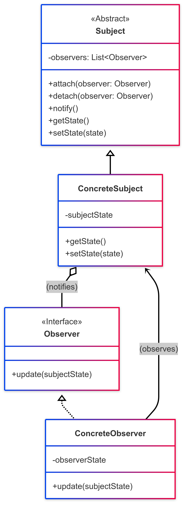
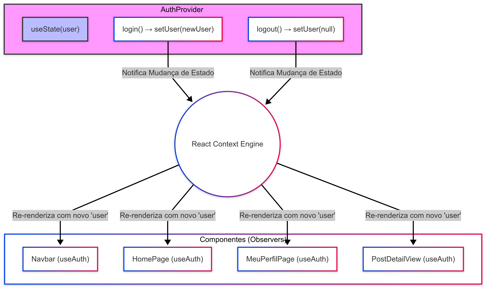
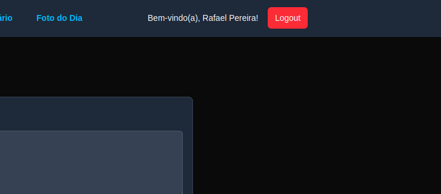

# Observer

## 1. Introdução ao Padrão Observer

O padrão Observer é um padrão de projeto **comportamental** que define uma dependência um-para-muitos entre objetos, de modo que quando um objeto (o *Subject* ou *Observable*) muda seu estado, todos os seus dependentes (os *Observers*) são notificados e atualizados automaticamente.<sup>1,5</sup>

Este padrão é essencial para implementar sistemas de eventos distribuídos e é a base de muitos frameworks de interface de usuário, incluindo a reatividade no React.

### 1.1. Problema que o Observer Resolve

Frequentemente, em um sistema, temos objetos cujo estado é de interesse para outros objetos. Manter esses objetos sincronizados pode ser um desafio. Uma abordagem ingênua seria fazer com que o objeto de interesse (Subject) conhecesse diretamente todos os objetos que precisam ser atualizados (Observers) e chamasse seus métodos de atualização. Isso, no entanto, leva a um alto acoplamento, tornando o sistema inflexível e difícil de manter.

O padrão Observer propõe uma solução onde o Subject mantém uma lista de seus Observers e notifica-os automaticamente sobre quaisquer mudanças de estado, sem precisar saber quem são esses observers em termos de suas classes concretas.

### 1.2. Estrutura e Participantes

O padrão Observer geralmente envolve os seguintes participantes:

* **Subject (Sujeito ou Observable):**
    * Conhece seus observers. Qualquer número de objetos Observer pode observar um Subject.
    * Fornece uma interface para anexar (registrar) e desanexar (remover) objetos Observer.
    * Notifica seus observers quando seu estado muda.<sup>6</sup>
* **Observer (Observador):**
    * Define uma interface de atualização para objetos que devem ser notificados sobre mudanças em um Subject.<sup>5</sup>
* **ConcreteSubject (Sujeito Concreto):**
    * Armazena o estado de interesse para os ConcreteObservers.
    * Envia uma notificação para seus observers quando seu estado muda.
* **ConcreteObserver (Observador Concreto):**
    * Mantém uma referência a um objeto ConcreteSubject.
    * Armazena o estado que deve permanecer consistente com o do Subject.
    * Implementa a interface de atualização do Observer para manter seu estado consistente com o do Subject.

### 1.3. Diagrama UML

Abaixo, na Figura 1, um diagrama UML representando a estrutura padrão do Observer:

<font size="3"><p style="text-align: center"><b>Figura 1:</b> Representação UML do Observer</p></font>
<center>



</center>

<font size="3"><p style="text-align: center"><b>Autores</b>: [Rafael Pereira](https://github.com/rafgpereira), [Milena Rocha](https://github.com/milenafrocha) e [Letícia Torres](https://github.com/leticiatmartins), 2025.</p></font>

#### Explicação do Diagrama:

- O `Subject` é a interface/classe base que os `ConcreteSubjects` herdam. Ele gerencia a lista de `Observers`.
- O `Observer` é a interface que os `ConcreteObservers` implementam, definindo o método `update()`.
- `ConcreteSubject` mantém o estado e notifica os `Observers` através do método `notify()` (herdado ou implementado).
- `ConcreteObserver` se registra com um `ConcreteSubject` e implementa `update()` para reagir às mudanças.

### 1.4. Como Funciona

- **1.** Os ConcreteObservers se registram (ou são registrados) com um ConcreteSubject.
- **2.** Quando o estado do ConcreteSubject muda (por exemplo, através de uma chamada a `setState()`), ele itera sobre sua lista de Observers registrados e chama o método `update()` de cada um, geralmente passando o novo estado (ou uma referência a si mesmo para que o Observer possa buscar o estado).<sup>5,6</sup>
- **3.** Cada ConcreteObserver, ao receber a notificação através do seu método `update()`, reage à mudança, por exemplo, atualizando seu próprio estado interno ou realizando alguma ação.

### 1.5. Benefícios

- **Acoplamento Fraco:** O Subject conhece apenas a interface abstrata do Observer, e não suas classes concretas. Isso permite adicionar novos Observers sem modificar o Subject.<sup>6</sup>
- **Reutilização:** Subjects e Observers podem ser reutilizados independentemente.
- **Suporte a Broadcast:** A notificação é enviada a todos os Observers registrados, permitindo uma comunicação um-para-muitos.
- **Dinamismo:** As relações entre Subjects e Observers podem ser estabelecidas e desfeitas em tempo de execução.

### 1.6. Desvantagens

- **Atualizações Inesperadas:** Se a lógica de notificação e atualização não for bem gerenciada, os observers podem ser notificados sobre mudanças irrelevantes ou em uma ordem inesperada.
- **Performance:** Notificar um grande número de observers pode levar a gargalos de desempenho.
- **Cascading Updates (Atualizações em Cascata):** Em alguns cenários, a atualização de um observer pode disparar outras atualizações, levando a cascatas complexas e difíceis de depurar (embora frameworks como o React gerenciem isso de forma eficiente).

---

## 2. Princípios do Observer no Frontend do Fórum Planetário Virtual

> 1. **Link da aplicação (deploy):** [Fórum Planetário Virtual](https://2025-1-t02-g7-planetario-virtual-en.vercel.app/)
>
> 2. **Link da pasta do frontend (código):** [Frontend Fórum](https://github.com/UnBArqDsw2025-1-Turma02/2025.1-T02-_G7_PlanetarioVirtual_Entrega_03/tree/main/projeto/grupo1/frontend)
>

No projeto do Fórum Planetário Virtual, desenvolvido com Next.js e React, os princípios do padrão Observer são aplicados principalmente através dos mecanismos reativos fornecidos pelo React, em vez de uma implementação manual do padrão.

## 2.1. O React Context API (AuthContext) como um "Subject" Global

> 1. **Link do AuthContext:** [Frontend - AuthContext](https://github.com/UnBArqDsw2025-1-Turma02/2025.1-T02-_G7_PlanetarioVirtual_Entrega_03/blob/main/projeto/grupo1/frontend/src/contexts/AuthContext.tsx)
>

O [_AuthContext_](https://github.com/UnBArqDsw2025-1-Turma02/2025.1-T02-_G7_PlanetarioVirtual_Entrega_03/blob/main/projeto/grupo1/frontend/src/contexts/AuthContext.tsx) implementado no projeto é um exemplo claro de como os princípios do **Observer** são utilizados para gerenciar e propagar um estado global, neste caso, o estado de **autenticação do usuário**.


- **AuthProvider (Gerenciador do Estado do Subject):**
    - O componente `AuthProvider` encapsula o estado do usuário (`user`) utilizando o hook `useState`. Este estado `user` é a informação central que outros componentes (atuando como Observers) precisam observar.
    - As funções `login(tipo)` e `logout()` dentro do `AuthProvider` modificam este estado user através da função `setUser`, que é fornecida pelo `useState`.

- **Componentes Consumidores (Observers):**
    - Componentes que utilizam o hook customizado `useAuth()` (que internamente chama `useContext(AuthContext)`) efetivamente se tornam "Observers" do estado `user`. Exemplos no projeto incluem [_Navbar_](https://github.com/UnBArqDsw2025-1-Turma02/2025.1-T02-_G7_PlanetarioVirtual_Entrega_03/blob/main/projeto/grupo1/frontend/src/components/layout/Navbar.tsx), [_MeuPerfilPage_](https://github.com/UnBArqDsw2025-1-Turma02/2025.1-T02-_G7_PlanetarioVirtual_Entrega_03/blob/main/projeto/grupo1/frontend/src/app/(main)/meu-perfil/page.tsx), [_HomePage_](https://github.com/UnBArqDsw2025-1-Turma02/2025.1-T02-_G7_PlanetarioVirtual_Entrega_03/blob/main/projeto/grupo1/frontend/src/app/(main)/page.tsx), e [_PostDetailView_](https://github.com/UnBArqDsw2025-1-Turma02/2025.1-T02-_G7_PlanetarioVirtual_Entrega_03/blob/main/projeto/grupo1/frontend/src/components/forum/PostDetailView.tsx).

- **Mecanismo de Notificação e Atualização (Gerenciado pelo React):**
    - Quando `setUser()` é chamado dentro do `AuthProvider` (como resultado de uma ação de `login()` ou `logout()`), o React detecta a mudança no valor do contexto.
    - O React então, de forma eficiente, "notifica" todos os componentes que estão consumindo esse contexto.
    - Essa "notificação" se manifesta como uma re-renderização dos componentes Observers, garantindo que a UI sempre reflita o estado de autenticação mais recente.

### 2.1.1. Exemplo da Interação com AuthContext

### a) [_AuthProvider_](https://github.com/UnBArqDsw2025-1-Turma02/2025.1-T02-_G7_PlanetarioVirtual_Entrega_03/blob/main/projeto/grupo1/frontend/src/contexts/AuthContext.tsx) (Gerenciador do Subject):

```javascript
// src/contexts/AuthContext.tsx
"use client";
import { createContext, useState, useContext, ReactNode } from 'react';
// ... outros imports ...

type User = { id: number; nome: string; tipo: 'comum' | 'moderador'; };
type AuthContextType = { user: User | null; login: (tipo: string) => void; logout: () => void; };

const AuthContext = createContext<AuthContextType | undefined>(undefined);

export function AuthProvider({ children }: { children: ReactNode }) {
  const [user, setUser] = useState<User | null>(null); // Estado observável
  // ... router ...

  const login = (tipo: 'comum' | 'moderador') => {
    let userData: User;
    if (tipo === 'moderador') {
      userData = { id: 1, nome: 'Milena Rocha', tipo: 'moderador' };
    } else {
      userData = { id: 2, nome: 'Rafael Pereira', tipo: 'comum' };
    }
    setUser(userData); // <- Mudança de estado que notifica os observers
    // ... router.push ...
  };

  const logout = () => {
    setUser(null); // <- Mudança de estado que notifica os observers
    // ... router.push ...
  };

  return (
    <AuthContext.Provider value={{ user, login, logout }}>
      {children}
    </AuthContext.Provider>
  );
}
// ... useAuth ...
```

### b) [_Navbar_](https://github.com/UnBArqDsw2025-1-Turma02/2025.1-T02-_G7_PlanetarioVirtual_Entrega_03/blob/main/projeto/grupo1/frontend/src/components/layout/Navbar.tsx) (Um Observer):

```javascript
// src/components/layout/Navbar.tsx
"use client";
import Link from 'next/link';
import { useAuth } from '@/contexts/AuthContext'; // Consome o contexto

export function Navbar() {
  const { user, logout } = useAuth(); // "Inscreve-se" para observar 'user'

  return (
    <nav /*...*/ >
      {/* ... */}
      <div className="hidden md:block">
        {user ? ( // Reage à mudança no estado 'user'
          <div className="flex items-center gap-4">
            <span className="text-sm">Bem-vindo(a), {user.nome}!</span>
            <button onClick={logout} /*...*/ >
              Logout
            </button>
          </div>
        ) : (
          <Link href="/login" /*...*/>
            Login
          </Link>
        )}
      </div>
      {/* ... */}
    </nav>
  );
}
```

### 2.1.2. Diagrama Conceitual da Aplicação no Frontend

Abaixo, na Figura 2, um diagrama representando a aplicação do Observer no contexto do frontend.
Esse diagrama ilustra conceitualmente o `AuthProvider` como o "Subject" (ou o gerenciador do estado observável) e os componentes como "Observers".

<font size="3"><p style="text-align: center"><b>Figura 2:</b> Representação do funcionamento do Observer no Fórum</p></font>
<center>



</center>

<font size="3"><p style="text-align: center"><b>Autores</b>: [Rafael Pereira](https://github.com/rafgpereira), [Milena Rocha](https://github.com/milenafrocha) e [Letícia Torres](https://github.com/leticiatmartins), 2025.</p></font>


### 2.1.3 Imagens

Abaixo, na Figura 3, apresenta-se uma parte da tela que exibe o botão de Login/Logout ao lado do nome do usuário que está autenticado no momento, o que é feito através do `AuthContext`.

<font size="3"><p style="text-align: center"><b>Figura 3:</b> Representação do Login e Autenticação</p></font>
<center>



</center>

<font size="3"><p style="text-align: center"><b>Autores</b>: [Rafael Pereira](https://github.com/rafgpereira), [Milena Rocha](https://github.com/milenafrocha) e [Letícia Torres](https://github.com/leticiatmartins), 2025.</p></font>

---

## 2.2. `useState` e `useEffect` como Mecanismos de Observação Local em Componentes

Dentro do escopo de componentes individuais, os hooks `useState` e `useEffect` do React também incorporam os princípios do padrão Observer para gerenciar e reagir a mudanças de estado local.

### 2.2.1. `useState`: Gerenciando Estado Observável Localmente

O hook `useState` permite que um componente declare e gerencie seu próprio estado interno.

- **Declaração do Estado (Subject Local):** Ao usar const `[meuEstado, setMeuEstado] = useState(valorInicial);`, o `meuEstado` se torna uma porção de dado observável dentro do componente.
- **Modificação do Estado e Notificação:** Quando a função setter (`setMeuEstado`) é chamada com um novo valor, o React "observa" essa mudança.
- **Atualização do Observer (Re-renderização):** O React então agenda uma re-renderização do componente (que atua como o Observer de seu próprio estado) e de seus filhos, se necessário. Na re-renderização, o componente terá acesso ao valor atualizado de `meuEstado`.

### Exemplo no [_MeuPerfilPage_](https://github.com/UnBArqDsw2025-1-Turma02/2025.1-T02-_G7_PlanetarioVirtual_Entrega_03/blob/main/projeto/grupo1/frontend/src/app/(main)/meu-perfil/page.tsx):

```javascript
// src/app/(main)/meu-perfil/page.tsx
"use client";
import { useState, useEffect } from 'react';
// ... outros imports ...
import type { Post } from '@/services/api'; 

export default function MeuPerfilPage() {
  // ... useAuth ...
  const [myPosts, setMyPosts] = useState<Post[]>([]); // 'myPosts' é um estado local observável
  const [isLoading, setIsLoading] = useState(true);   // 'isLoading' é outro estado local observável

  useEffect(() => {
    // ... lógica de fetch ...
    const fetchMyPosts = async () => {
      setIsLoading(true); // Modifica 'isLoading', o componente observará e poderá re-renderizar
      // ...
      try {
        const posts = await getPostsByUserId(user.id); 
        setMyPosts(posts); // Modifica 'myPosts', o componente observará e re-renderizará com a nova lista
      } catch (err) {
        // ...
      } finally {
        setIsLoading(false); // Modifica 'isLoading' novamente
      }
    };
    // ...
  }, [user]); 
  // ...
}
```
Nesse exemplo, `myPosts` e `isLoading` são estados locais. O componente `MeuPerfilPage` "observa" esses estados. Chamadas a `setMyPosts` ou `setIsLoading` disparam o mecanismo de atualização do React.

### 2.2.2. `useEffect`: Reagindo a Mudanças em Estados Observados

O hook `useEffect` permite executar efeitos colaterais (como buscar dados, manipular o DOM(Document Object Model), configurar subscriptions) em resposta a mudanças no estado do componente ou em props.

- **Observando Dependências:** O array de dependências do `useEffect(callback, [dep1, dep2])` define quais valores (estados ou props) o efeito está "observando".
- **Reação à Mudança:** Se qualquer valor no array de dependências mudar entre renderizações, o React executa a função de `callback` novamente. Isso é análogo a um Observer sendo notificado e executando sua lógica de `update`.

### Exemplo no [_MeuPerfilPage_](https://github.com/UnBArqDsw2025-1-Turma02/2025.1-T02-_G7_PlanetarioVirtual_Entrega_03/blob/main/projeto/grupo1/frontend/src/app/(main)/meu-perfil/page.tsx):


```javascript
// src/app/(main)/meu-perfil/page.tsx
// ...
export default function MeuPerfilPage() {
  const { user } = useAuth(); 
  const [myPosts, setMyPosts] = useState<Post[]>([]);
  const [isLoading, setIsLoading] = useState(true);

  // Este useEffect "observa" a variável 'user' (que vem do AuthContext)
  useEffect(() => {
    const fetchMyPosts = async () => {
      if (!user) { // Se user é null, não faz nada ou limpa os posts
        setMyPosts([]);
        setIsLoading(false);
        return;
      }
      setIsLoading(true);
      try {
        const posts = await getPostsByUserId(user.id);
        setMyPosts(posts.sort((a, b) => new Date(b.dataCriacao).getTime() - new Date(a.dataCriacao).getTime()));
      } catch (err) {
        // ... tratamento de erro ...
      } finally {
        setIsLoading(false);
      }
    };

    fetchMyPosts(); // Executa a busca quando 'user' muda (e na montagem inicial se 'user' estiver definido)

  }, [user]); // Array de dependências: o efeito re-executa se 'user' mudar
  // ...
}
```

Aqui, o `useEffect` reage a mudanças na propriedade `user`. Se o `user` mudar (por exemplo, após um login ou logout), a função `fetchMyPosts` é chamada novamente, atualizando os dados do perfil. O `useEffect` está, portanto, agindo como um Observer para o estado user.

---

## 2.3. Benefícios no Projeto do Fórum Planetário Virtual

A utilização desses mecanismos reativos do React, que espelham o padrão Observer, traz diversos benefícios:

- **Interface Reativa e Consistente:** A UI é atualizada automaticamente quando dados relevantes (sejam globais como o user do `AuthContext`, ou locais como `myPosts`) mudam, garantindo consistência visual.
- **Desacoplamento:** Os componentes que gerenciam o estado (como `AuthProvider` ou um componente com `useState`) não precisam conhecer os detalhes de todos os componentes que consomem esse estado. Os consumidores apenas "se inscrevem" para receber as atualizações.
- **Gerenciamento de Estado Declarativo:** Em vez de imperativamente atualizar múltiplos locais da UI, o estado é atualizado em um local, e a UI reage declarativamente.
- **Composição de Comportamento:** `useEffect` permite compor comportamentos que reagem a diferentes mudanças de estado de forma limpa.

---

## Referências Bibliográficas


> 1. GAMMA, E.; HELM, R.; JOHNSON, R.; VLISSIDES, J. Design Patterns: Elements of Reusable Object-Oriented Software. Reading, MA: Addison-Wesley, 1995.
>
> 2. FREEMAN, E.; ROBSON, E.; BATES, B.; SIERRA, K. Head First Design Patterns. Sebastopol, CA: O'Reilly Media, 2004.
>
> 3. REFACTORING GURU. Observer Pattern. Refactoring Guru, [s.d.]. Disponível em: [https://refactoring.guru/design-patterns/observer](https://refactoring.guru/design-patterns/observer). Acesso em: 2 jun. 2025.
>
> 4.  SOURCEMAKING. **Observer Design Pattern**. Sourcemaking, [s.d.]. Disponível em: [https://sourcemaking.com/design_patterns/observer/java/1](https://sourcemaking.com/design_patterns/observer/java/1). Acesso em: 2 jun. 2025.
>
> 5.  TUTORIALSPOINT.COM. **Observer Pattern - Design Pattern**. Tutorialspoint.com, [s.d.]. Disponível em: [https://www.tutorialspoint.com/design_pattern/observer_pattern.htm](https://www.tutorialspoint.com/design_pattern/observer_pattern.htm). Acesso em: 2 jun. 2025.


## Histórico de Versões

| Versão | Data       | Descrição                                      | Autor               | Revisor            |
|--------|------------|------------------------------------------------|---------------------|--------------------|
| 1.0    | 01/06/2025 | Criação do documento com a introdução do observer | [Rafael Pereira](https://github.com/rafgpereira), [Milena Rocha](https://github.com/milenafrocha)  | [Letícia Torres](https://github.com/leticiatmartins)   | 
| 1.1    | 02/06/2025 | Adição da aplicação do observer no frontend do fórum | [Letícia Torres](https://github.com/leticiatmartins), [Rafael Pereira](https://github.com/rafgpereira)    | [Milena Rocha](https://github.com/milenafrocha)    |
| 1.2    | 02/06/2025 | Adição de novas referências | [Rafael Pereira](https://github.com/rafgpereira)      | [Milena Rocha](https://github.com/milenafrocha)    |