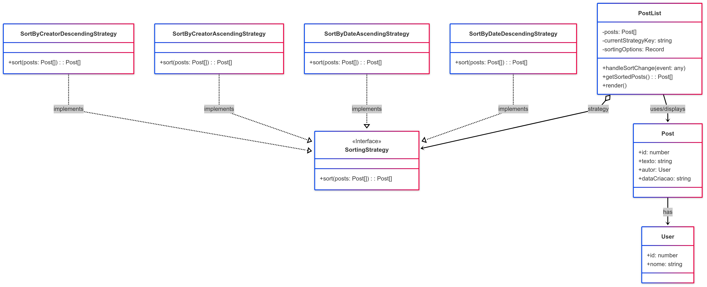
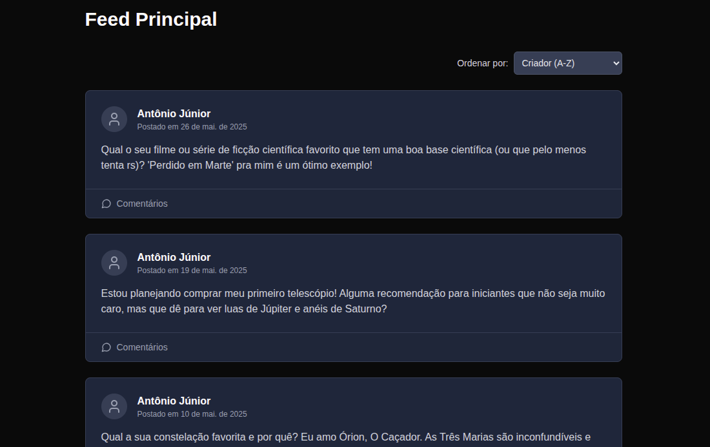

# Strategy

## 1. Introdução ao Padrão Strategy

O padrão Strategy é um padrão de projeto **comportamental** que permite definir uma família de algoritmos, encapsular cada um deles e torná-los intercambiáveis. O Strategy permite que o algoritmo varie independentemente dos clientes que o utilizam.

Este padrão é útil quando você tem várias maneiras de realizar uma tarefa específica e deseja permitir que o cliente escolha ou altere o algoritmo em tempo de execução.

### 1.1. Problema que o Strategy Resolve

Imagine que você tem uma classe que precisa executar uma determinada ação, mas existem múltiplas variações ou algoritmos para essa ação. Se você implementar todas essas variações diretamente na classe usando condicionais (ex: `if-else` ou `switch`), a classe se tornará complexa, difícil de manter e de estender com novos algoritmos. Além disso, o cliente fica acoplado a todas essas implementações.

O Strategy resolve esse problema isolando os algoritmos em classes separadas (as "estratégias"), que compartilham uma interface comum. A classe principal (o "Contexto") então delega a execução da ação para um objeto de estratégia, que pode ser substituído em tempo de execução.

### 1.2. Estrutura e Participantes

O padrão Strategy geralmente envolve os seguintes participantes:

-   **Strategy (Estratégia)**: Define uma interface comum para todos os algoritmos suportados. O `Context` usa esta interface para chamar o algoritmo definido por uma `ConcreteStrategy`.
-   **ConcreteStrategy (Estratégia Concreta)**: Implementa um algoritmo específico usando a interface `Strategy`. Podem existir múltiplas estratégias concretas.
-   **Context (Contexto)**:
    * É configurado com um objeto `ConcreteStrategy`.
    * Mantém uma referência a um objeto `Strategy`.
    * Pode definir uma interface que permite aos clientes substituir a `Strategy`.
    * Chama o algoritmo na sua `Strategy` quando uma operação precisa ser realizada.

### 1.3. Diagrama UML

Abaixo, na Figura 1, um diagrama UML representando a estrutura do padrão Strategy:

<font size="3"><p style="text-align: center"><b>Figura 1:</b> Representação UML do Padrão Strategy</p></font>
<center>



</center>
<font size="3"><p style="text-align: center"><b>Autor</b>: [Joao Pedro](https://github.com/joaopedrooss), 2025.</p></font>

## Explicação do diagrama
-   O `Client` (não explicitamente mostrado, mas é quem usa o `Context`) interage com o `Context`.
-   O `Context` possui uma referência a um objeto `Strategy`.
-   O `Context` pode ter um método (`setStrategy()`) para alterar a estratégia em tempo de execução.
-   Quando uma operação (`executeStrategy()`) é chamada no `Context`, ele delega a chamada para o método `execute()` da `Strategy` atual.
-   `ConcreteStrategyA` e `ConcreteStrategyB` são implementações específicas da interface `Strategy`.

### 1.4. Como Funciona

1.  **Definição da Interface Strategy**: Uma interface é criada para representar a ação ou algoritmo (ex: `sort()`, `calculate()`).
2.  **Implementação das Concrete Strategies**: Várias classes implementam a interface Strategy, cada uma fornecendo uma variação do algoritmo.
3.  **Configuração do Context**: O Contexto é instanciado ou configurado com uma Concrete Strategy específica (seja no construtor, por um método setter, ou escolhida dinamicamente).
4.  **Delegação**: Quando o Contexto precisa executar a ação, ele chama o método definido na interface Strategy do objeto de estratégia que ele possui. A Concrete Strategy selecionada então executa seu algoritmo específico.
5.  **Troca de Strategy (Opcional)**: O cliente pode alterar a estratégia associada ao Contexto em tempo de execução, se o Contexto permitir.

### 1.5. Benefícios

-   **Flexibilidade e Extensibilidade**: Facilita a adição de novos algoritmos (novas Concrete Strategies) sem modificar o Contexto ou outras estratégias.
-   **Elimina Condicionais**: Substitui múltiplas estruturas condicionais (if-else, switch) por polimorfismo, tornando o código mais limpo e organizado.
-   **Reutilização de Algoritmos**: Os algoritmos encapsulados nas Concrete Strategies podem ser reutilizados por diferentes Contextos.
-   **Desacoplamento**: O Contexto fica desacoplado das implementações específicas dos algoritmos. Ele só conhece a interface Strategy.
-   **Testabilidade**: Cada Concrete Strategy pode ser testada isoladamente.

### 1.6. Desvantagens

-   **Aumento do Número de Objetos**: A aplicação pode acabar com um grande número de objetos Strategy se houver muitas variações de algoritmos.
-   **Sobrecarga para o Cliente**: O cliente precisa conhecer as diferentes Strategies para escolher a mais adequada e passá-la ao Contexto, a menos que o Contexto gerencie essa seleção internamente.
-   **Complexidade Adicional para Algoritmos Simples**: Se os algoritmos forem muito simples, o padrão pode introduzir uma complexidade desnecessária.

---

## 2. Aplicação do Padrão Strategy no Projeto Fórum

No projeto do Fórum Planetário Virtual, o padrão Strategy foi aplicado para permitir a ordenação de postagens na lista principal de acordo com diferentes critérios selecionados pelo usuário, como data de criação (mais recentes ou mais antigos primeiro) e nome do autor (A-Z ou Z-A).

### 2.1. Informações do Projeto e Implementação

> 1.  **Link da aplicação (deploy):** [Fórum Planetário Virtual](https://2025-1-t02-g7-planetario-virtual-en.vercel.app/) (A funcionalidade de ordenação deve estar na listagem de posts)
> 2.  **Link da pasta do frontend (código):** [Frontend Fórum](https://github.com/UnBArqDsw2025-1-Turma02/2025.1-T02-_G7_PlanetarioVirtual_Entrega_03/tree/main/projeto/grupo1/frontend)
> 3.  **Links da implementação do Strategy:**
>     * Interface e Estratégias Concretas: [`src/lib/sortingStrategies.ts`](https://github.com/UnBArqDsw2025-1-Turma02/2025.1-T02-_G7_PlanetarioVirtual_Entrega_03/tree/main/grupo1/frontend/src/app/lib/sortingStrategies.tsx)
>     * Contexto (Componente React): [`src/components/forum/PostList.tsx`](https://github.com/UnBArqDsw2025-1-Turma02/2025.1-T02-_G7_PlanetarioVirtual_Entrega_03/blob/main/projeto/grupo1/frontend/src/components/forum/PostList.tsx)
> 4.  **Link da documentação das Rotas do Backend (para estrutura dos dados do Post):** [Swagger Backend](https://two025-1-t02-g7-planetariovirtual.onrender.com/docs)

### 2.2. Contexto do Problema no Fórum

O frontend do Fórum precisa exibir uma lista de postagens (`Post[]`). Para melhorar a experiência do usuário, é desejável que ele possa ordenar essas postagens por diferentes critérios:
* Data de criação (mais recentes primeiro - padrão).
* Data de criação (mais antigos primeiro).
* Nome do autor (ordem alfabética A-Z).
* Nome do autor (ordem alfabética Z-A).

Implementar essa lógica diretamente no componente `PostList` com múltiplas condicionais tornaria o código do componente complexo e difícil de estender com novos critérios de ordenação no futuro.

### 2.3. Solução com o Padrão Strategy

Para resolver esse problema, foi adotado o padrão Strategy:

1.  **`SortingStrategy` (Interface Strategy)**: Uma interface TypeScript foi definida em `src/lib/sortingStrategies.ts` para estabelecer um contrato comum para todas as estratégias de ordenação. Ela define um método `sort(posts: Post[]): Post[]`.
2.  **Estratégias Concretas**: Para cada critério de ordenação, uma classe concreta foi criada, implementando a interface `SortingStrategy`:
    * `SortByDateDescendingStrategy`: Ordena os posts pela data de criação, do mais recente para o mais antigo.
    * `SortByDateAscendingStrategy`: Ordena os posts pela data de criação, do mais antigo para o mais recente.
    * `SortByCreatorAscendingStrategy`: Ordena os posts pelo nome do autor, em ordem alfabética (A-Z).
    * `SortByCreatorDescendingStrategy`: Ordena os posts pelo nome do autor, em ordem alfabética inversa (Z-A).
3.  **`PostList.tsx` (Contexto)**: O componente React `PostList` atua como o Contexto.
    * Ele mantém um estado (`currentStrategyKey`) para saber qual estratégia de ordenação está selecionada.
    * Ele possui um mapa (`sortingOptions`) que associa chaves de string (ex: `'dateDesc'`) a instâncias das estratégias concretas.
    * Ele permite ao usuário selecionar a estratégia de ordenação através de um elemento `<select>`.
    * Quando a estratégia é alterada ou a lista de posts é recebida, ele usa a estratégia selecionada para ordenar os posts antes de renderizá-los. A ordenação é feita dentro de um hook `useMemo` para otimização.

### 2.4. Exemplo da Implementação

#### a) Interface Strategy e Estratégias Concretas (`src/lib/sortingStrategies.ts`)

```typescript
// src/lib/sortingStrategies.ts
import type { Post } from '@/services/api'; // Tipo Post definido em api.ts ou similar

// Interface da Strategy
export interface SortingStrategy {
  sort(posts: Post[]): Post[];
}

// Strategy Concreta: Ordenar por Data (Mais recentes primeiro)
export class SortByDateDescendingStrategy implements SortingStrategy {
  sort(posts: Post[]): Post[] {
    return [...posts].sort((a, b) => new Date(b.dataCriacao).getTime() - new Date(a.dataCriacao).getTime());
  }
}

// Strategy Concreta: Ordenar por Criador (Nome A-Z)
export class SortByCreatorAscendingStrategy implements SortingStrategy {
  sort(posts: Post[]): Post[] {
    return [...posts].sort((a, b) => a.autor.nome.localeCompare(b.autor.nome));
  }
}
// ... Outras estratégias (SortByDateAscendingStrategy, SortByCreatorDescendingStrategy) ...
```
## PostList

```TypeScript
"use client";

import type { Post } from '@/services/api';
import { PostItem } from './PostItem';
import { useState, useMemo } from 'react';
import {
  SortingStrategy,
  SortByDateDescendingStrategy,
  SortByDateAscendingStrategy,
  SortByCreatorAscendingStrategy,
  SortByCreatorDescendingStrategy
  // Importe outras estratégias que criar
} from '../../app/lib/sortingStrategies'; // Certifique-se que o caminho está correto

type PostListProps = {
  posts: Post[]; // Usando 'posts' como nome da prop, conforme seu código original
  onDeletePost: (postId: number) => void;
};

// Mapeamento das chaves para instâncias das estratégias
const sortingOptions: Record<string, SortingStrategy> = {
  dateDesc: new SortByDateDescendingStrategy(),
  dateAsc: new SortByDateAscendingStrategy(),
  creatorAsc: new SortByCreatorAscendingStrategy(),
  creatorDesc: new SortByCreatorDescendingStrategy(),
};

type SortingOptionKey = keyof typeof sortingOptions;

export function PostList({ posts, onDeletePost }: PostListProps) {
  const [currentStrategyKey, setCurrentStrategyKey] = useState<SortingOptionKey>('dateDesc'); // Padrão: mais recentes

  const handleSortChange = (event: React.ChangeEvent<HTMLSelectElement>) => {
    setCurrentStrategyKey(event.target.value as SortingOptionKey);
  };

  const sortedPosts = useMemo(() => {
    // Garante que 'posts' é um array e não está vazio antes de tentar ordenar
    if (!Array.isArray(posts) || posts.length === 0) {
      return []; // Retorna array vazio se 'posts' não for um array ou estiver vazio
    }

    const strategy = sortingOptions[currentStrategyKey];
    if (strategy) {
      // As estratégias de ordenação criam um novo array ordenado ([...posts])
      return strategy.sort(posts);
    }
    // Fallback: retorna os posts originais se uma estratégia não for encontrada (improvável)
    return posts;
  }, [posts, currentStrategyKey]); // Dependências: re-executa se 'posts' ou 'currentStrategyKey' mudar

  // Verifica se, após a tentativa de ordenação, há posts para exibir.
  // Isso cobre o caso de 'posts' ser inicialmente vazio.
  if (sortedPosts.length === 0) {
    return <p className="text-gray-400 text-center py-10">Nenhuma postagem para exibir.</p>;
  }

  return (
    <div>
      <div className="mb-6 flex justify-between items-center">
        {/* Pode adicionar um título se quiser, como "Postagens" */}
        {/* <h2 className="text-2xl font-semibold text-white">Postagens</h2> */}
        <div className="flex-grow"></div> {/* Espaçador para empurrar o select para a direita se não houver título */}
        <div className="flex items-center">
          <label htmlFor="sort-posts" className="text-gray-300 mr-2 text-sm font-medium">
            Ordenar por:
          </label>
          <select
            id="sort-posts"
            value={currentStrategyKey}
            onChange={handleSortChange}
            className="bg-gray-700 text-gray-200 border border-gray-600 rounded-md p-2 text-sm focus:outline-none focus:ring-2 focus:ring-blue-500 transition-colors"
          >
            <option value="dateDesc">Data (Mais recentes)</option>
            <option value="dateAsc">Data (Mais antigos)</option>
            <option value="creatorAsc">Criador (A-Z)</option>
            <option value="creatorDesc">Criador (Z-A)</option>
          </select>
        </div>
      </div>

      {sortedPosts.map((post) => (
        <PostItem
          key={post.id}
          post={post}
          onDelete={onDeletePost}
        />
      ))}
    </div>
  );
}
```

### 2.5. Imagens da Implementação

Abaixo, na Figura 2, apresenta-se a tela do [Fórum Planetário Virtual](https://2025-1-t02-g7-planetario-virtual-en.vercel.app/) exibindo a lista de postagens. Essas postagens são **ordenadas dinamicamente conforme a opção selecionada pelo usuário, aplicando o padrão Strategy** para alterar o critério de ordenação (por data, autor, etc.), e então renderizadas pelo Next.js na interface do navegador.

<font size="3"><p style="text-align: center"><b>Figura 2:</b> Tela de Feed de Postagens do Fórum com Ordenação via Strategy</p></font>
<center>




</center>
<font size="3"><p style="text-align: center"><b>Autor</b>: [Joao Pedro](https://github.com/joaopedrooss), 2025.</p></font>


## Referências Bibliográficas

> 4.  SOURCEMAKING. Strategy Design Pattern. SourceMaking, \[s.d.\]. Disponível em: https://sourcemaking.com/design_patterns/strategy. Acesso em: 02 jun. 2025.
> 5.  WIKIPEDIA. Strategy pattern. Wikipedia, The Free Encyclopedia, \[s.d.\]. Disponível em: https://en.wikipedia.org/wiki/Strategy_pattern. Acesso em: 02 jun. 2025.
> 6.  LARMAN, C. Applying UML and Patterns: An Introduction to Object-Oriented Analysis and Design and Iterative Development. 3rd ed. Upper Saddle River, NJ: Prentice Hall PTR, 2005.

## Histórico de Versões

| Versão | Data       | Descrição                                      | Autor               | Revisor            |
|--------|------------|------------------------------------------------|---------------------|--------------------|
| 1.0    | 30/05/2025 | Criação do documento com a introdução do adapter | [Joao Pedro](https://github.com/joaopedrooss)   |       [Joao Lucas](https://github.com/jlucasiqueira)   | 

