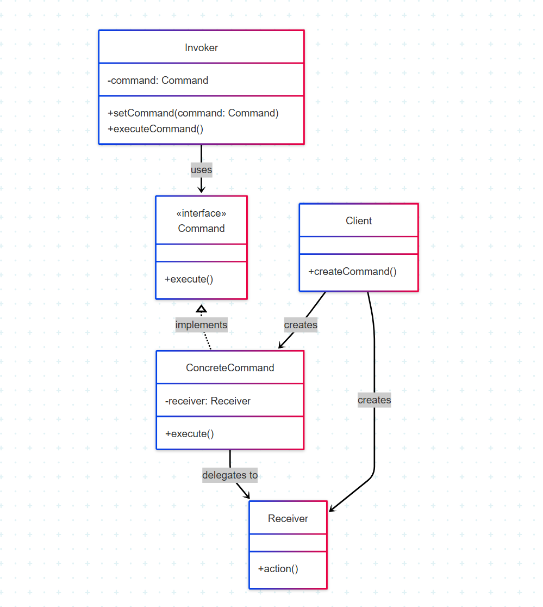

# Padrão Command

## 1. Introdução ao Padrão Command

O padrão Command é um padrão de projeto **comportamental** que converte uma solicitação em um objeto independente que contém todas as informações sobre a solicitação. Essa transformação permite parametrizar métodos com diferentes solicitações, atrasar ou enfileirar a execução de uma solicitação e suportar operações que podem ser desfeitas.<sup>1</sup>

Este padrão é útil para implementar sistemas que precisam de operações como:
- Desfazer/refazer
- Filas de comandos
- Operações de registro (logging)
- Transações

## 1.1. Problema que o Command Resolve

Em sistemas complexos, é comum a necessidade de:
- Enviar solicitações para objetos sem conhecer detalhes da operação
- Executar diferentes comandos no mesmo invocador (ex: botões em UI)
- Evitar acoplamento direto entre invocador e executor

**Exemplo**: Em uma interface gráfica, um botão pode precisar executar diferentes comandos dependendo do contexto. O acoplamento direto torna a manutenção difícil.

**Solução do Command**: Desacoplar o objeto que invoca a operação do objeto que sabe executá-la.

## 1.2. Estrutura e Participantes

### Participantes principais:

| Participante          | Descrição |
|-----------------------|-----------|
| **Command**           | Interface para execução de operação |
| **ConcreteCommand**   | Implementação concreta do comando |
| **Invoker**           | Solicita a execução do comando |
| **Receiver**          | Contém a lógica de negócio real |
| **Client**            | Configura e cria os comandos |

## 1.3. Diagrama UML

<font size="3"><p style="text-align: center"><b>Figura 1:</b> Representação UML do Command</p></font>
<center>



</center>

<font size="3"><p style="text-align: center"><b>Autor</b>: [Raphaela Guimarães], 2025.</p></font>

## 1.2. Participantes

| Participante        | Descrição                                                                 |
|---------------------|---------------------------------------------------------------------------|
| **Command**         | Interface abstrata que declara o método `execute()` para execução         |
| **ConcreteCommand** | Implementação concreta que vincula uma ação a um Receiver                 |
| **Invoker**         | Solicita a execução do comando através do método `execute()`              |
| **Receiver**        | Contém a lógica de negócio real que será executada pelo comando           |
| **Client**          | Responsável por criar e configurar os objetos Command e seus Receivers    |

#### Exemplo de Invokers (Invocadores)

**Criação da postagem**: 

```java
@PostMapping
@Operation(summary = "Create a new postagem", description = "Create a new postagem entry")
@ApiResponse(responseCode = "201", description = "Postagem successfully created")
@ApiResponse(responseCode = "400", description = "Invalid input")
@ApiResponse(responseCode = "404", description = "Author not found")
public ResponseEntity<PostagemResponseDTO> createPostagem(@Valid @RequestBody PostagemDTO postagemDTO) {
    // Esta linha delega a ação para o serviço,
    // que internamente deverá criar e executar um CreatePostagemCommand
    PostagemResponseDTO newPostagem = postagemService.createPostagem(postagemDTO);
    return ResponseEntity.status(HttpStatus.CREATED).body(newPostagem);
}
```
**Curtir postagem**: 
```java
@PatchMapping("/{id}/like")
@Operation(summary = "Like a postagem", description = "Increment the like count of a postagem")
@ApiResponse(responseCode = "200", description = "Postagem liked successfully")
@ApiResponse(responseCode = "404", description = "Postagem not found")
public ResponseEntity<PostagemResponseDTO> likePostagem(@PathVariable Long id) {
    // Esta linha delega a ação de "curtir" para o serviço,
    // que internamente deverá criar e executar um LikePostagemCommand
    PostagemResponseDTO likedPostagem = postagemService.likePostagem(id);
    return ResponseEntity.ok(likedPostagem);
}
```
#### Exemplo de Receiver:

```java
@Service
public class PostagemService {

    private final PostagemRepository postagemRepository;
    private final UserRepository userRepository;
    @Autowired
    public PostagemService(PostagemRepository postagemRepository, UserRepository userRepository) {
        this.postagemRepository = postagemRepository;
        this.userRepository = userRepository;
    }

    public List<PostagemResponseDTO> getAllPostagens() {
        return postagemRepository.findAll().stream()
                .map(this::convertToResponseDTO)
                .collect(Collectors.toList());
    }

    public PostagemResponseDTO getPostagemById(Long id) {
        Postagem postagem = postagemRepository.findById(id)
                .orElseThrow(() -> new UserNotFoundException("Postagem not found with id: " + id));
        return convertToResponseDTO(postagem);
    }

    public PostagemResponseDTO createPostagem(PostagemDTO postagemDTO) {
        User autor = userRepository.findById(postagemDTO.getAutorId())
                .orElseThrow(() -> new UserNotFoundException("Author not found with id: " + postagemDTO.getAutorId()));

        Postagem newPostagem = new Postagem.PostagemBuilder()
                .texto(postagemDTO.getTexto())
                .autor(autor)
                .dataCriacao(LocalDateTime.now())
                .totalCurtidas(0)
                .totalNaoCurtidas(0)
                .build();

        Postagem savedPostagem = postagemRepository.save(newPostagem);
        return convertToResponseDTO(savedPostagem);
    }

    public PostagemResponseDTO updatePostagem(Long id, PostagemDTO postagemDTO) {
        Postagem existingPostagem = postagemRepository.findById(id)
                .orElseThrow(() -> new UserNotFoundException("Postagem not found with id: " + id));

        if (postagemDTO.getTexto() != null && !postagemDTO.getTexto().isBlank()) {
            existingPostagem.setTexto(postagemDTO.getTexto());
        }


        Postagem updatedPostagem = postagemRepository.save(existingPostagem);
        return convertToResponseDTO(updatedPostagem);
    }

    public PostagemResponseDTO likePostagem(Long id) {
        Postagem existingPostagem = postagemRepository.findById(id)
                .orElseThrow(() -> new UserNotFoundException("Postagem not found with id: " + id));
        existingPostagem.setTotalCurtidas(existingPostagem.getTotalCurtidas() + 1);
        Postagem updatedPostagem = postagemRepository.save(existingPostagem);
        return convertToResponseDTO(updatedPostagem);
    }

    public PostagemResponseDTO dislikePostagem(Long id) {
        Postagem existingPostagem = postagemRepository.findById(id)
                .orElseThrow(() -> new UserNotFoundException("Postagem not found with id: " + id));
        existingPostagem.setTotalNaoCurtidas(existingPostagem.getTotalNaoCurtidas() + 1);
        Postagem updatedPostagem = postagemRepository.save(existingPostagem);
        return convertToResponseDTO(updatedPostagem);
    }

    public void deletePostagem(Long id) {
        if (!postagemRepository.existsById(id)) {
            throw new UserNotFoundException("Postagem not found with id: " + id);
        }
        postagemRepository.deleteById(id);
    }

    private PostagemResponseDTO convertToResponseDTO(Postagem postagem) {
        return new PostagemResponseDTO(
                postagem.getId(),
                postagem.getTexto(),
                postagem.getAutor() != null ? postagem.getAutor().getId() : null,
                postagem.getAutor() != null ? postagem.getAutor().getName() : null,
                postagem.getAutor() != null ? postagem.getAutor().getEmail() : null,
                postagem.getDataCriacao(),
                postagem.getTotalCurtidas(),
                postagem.getTotalNaoCurtidas()
        );
    }
}
```

## 1.3. Benefícios

**Desacoplamento**  
   - Separa claramente quem invoca a operação (Invoker) de quem a executa (Receiver)
   - Permite alterações em ambos os lados sem impactos diretos

**Comandos Compostos**  
   - Possibilidade de criar:
     - *Macro commands* (combinação de comandos)
     - *Command queues* (filas de execução)
     - *Transactional commands* (execução atômica)

**Undo/Redo**  
   - Padrão natural para implementar:
     ```typescript
     interface Command {
       execute(): void;
       undo(): void;  // Operação reversa
     }
     ```
   - Mantém histórico de estados

**Flexibilidade**  
   - Comandos podem ser:
     - Serializados
     - Logados
     - Agendados
     - Enfileirados

**Extensibilidade**  
   - Novos comandos podem ser adicionados sem modificar:
     - Código existente do Invoker
     - Lógica do Receiver

## 2. Vantagens na Aplicação Prática

### 2.1. Benefícios no Desenvolvimento

**Isolamento de Responsabilidades**  
Separa claramente a lógica de negócio da invocação das operações, permitindo que cada componente se concentre em uma única responsabilidade.

**Flexibilidade Operacional**  
Permite que operações complexas sejam compostas, enfileiradas ou agendadas sem modificar o código existente, seguindo o princípio Open/Closed.

**Gerenciamento de Estado**  
Facilita a implementação de funcionalidades avançadas como desfazer/refazer, histórico de operações e sistemas de auditoria.

### 2.2. Casos de Uso Típicos

**Interface do Usuário**  
Ideal para gerenciar ações de botões e menus onde uma mesma interface pode disparar diferentes comandos conforme o contexto.

**Sistemas Distribuídos**  
Permite o encapsulamento de requisições para execução remota, sendo fundamental em arquiteturas baseadas em mensagens.

**Processamento em Lote**  
Facilita a criação e gerenciamento de filas de comandos para processamento assíncrono ou em background.

## Referências Bibliográficas

1. GAMMA, Erich et al. *Padrões de Projeto: Elementos de Software Orientado a Objetos Reutilizável*. Bookman, 2000.

2. FREEMAN, Eric; ROBSON, Elisabeth. *Use a Cabeça! Padrões de Projetos*. Alta Books, 2009.

3. MARTIN, Robert C. *Clean Architecture: A Craftsman's Guide to Software Structure and Design*. Prentice Hall, 2017.

## Histórico de Versões

| Versão | Data       | Descrição                                      | Autor               | Revisor            |
|--------|------------|------------------------------------------------|---------------------|--------------------|
| 1.0    | 02/06/2025 | Versão inicial do documento        | [Raphaela Guimarães](https://github.com/raphaiela)      |  [Taynara Vitorino](https://github.com/taybalau)                         | 
| 1.1    | 02/06/2025 | Versão inicial do documento        | [Antônio Júnior](https://github.com/antonioleaojr)      | [Taynara Vitorino](https://github.com/taybalau)      |

