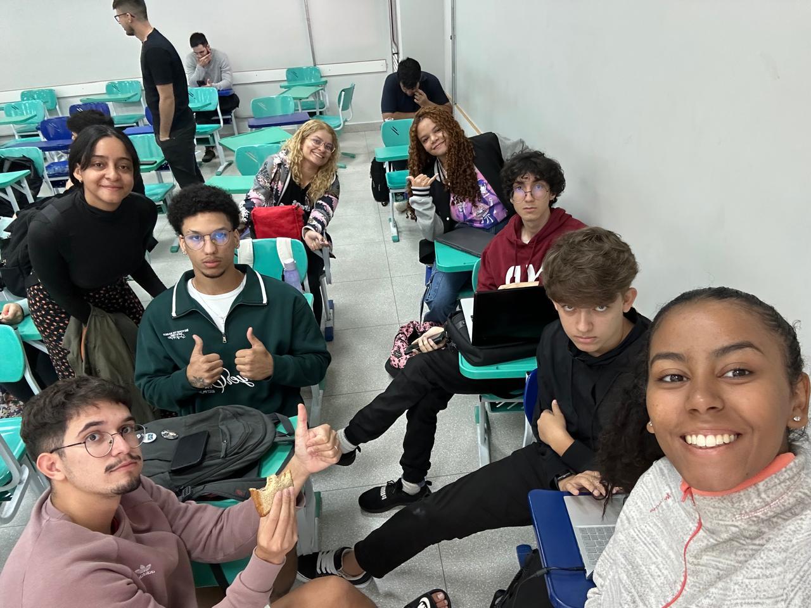

# Ata da Reunião – Arquitetura e Desenho de Software

**Data:** 19/05/2025

**Participantes Presentes:**

* Raphaela Guimarães de Araújo dos Santos
* Taynara Gabrielle Vitorino
* Letícia Torres Soares Martins
* Rafael Gomes Pereira
* João Pedro Silva Sousa
* João Lucas Araújo Siqueira
* Manoel Castro Moura Filho
* Milena Fernandes Rocha

---

## Assunto

**Reunião de abertura da Entrega 3** do projeto *Planetário Virtual*, com foco na definição das primeiras tarefas, levantamento de pendências da entrega anterior e alinhamento das expectativas para a nova fase.

---

## Próxima Reunião

**Atividades previstas:**

* Levantamento dos artefatos obrigatórios e voluntários da Entrega 3.
* Revisão crítica dos diagramas da Entrega 2 para alinhamento com os novos objetivos.
* Início do planejamento da nova divisão de tarefas.

**Data prevista:** a definir em grupo, com base na agenda de compromissos acadêmicos.

---

## Consolidação da Reunião

> Organização realizada durante a reunião de 19/05/2025.

### Contexto e Ações Realizadas

A equipe se reuniu presencialmente **na FCTE/UnB, sala S5**, logo após a aula de Arquitetura e Desenho de Software, para organizar os primeiros passos da Entrega 3.

* Confirmaram quais artefatos da Entrega 3.
* Debateram a importância de manter a coerência entre os diagramas nas próximas entregas.
* Iniciaram o planejamento para a estruturação dos artefatos da Entrega 3.
* Reforçaram o compromisso com a entrega de artefatos com senso crítico e aprofundamento técnico, como nas entregas anteriores.

---

## Cronograma da Reunião

**Tabela 1: Cronograma da Reunião**

| Data       | Hora  | Mediador                                        | Duração | Local                          |
| ---------- | ----- | ----------------------------------------------- | ------- | ------------------------------ |
| 19/05/2025 | 09:50 | [Milena Rocha](https://github.com/milenafrocha) | 15min   | Presencial – FCTE/UnB, sala S5 |

<b>Autores: [Milena Rocha](https://github.com/milenafrocha)</b>

---

## Encaminhamentos

* Confirmar no grupo os artefatos obrigatórios da Entrega 3.
* Agendar nova reunião com foco técnico, voltada à construção das entregas desta fase.
* Dividir os grupos e decidir quais GOFs serão entregues.

---

## Link da Gravação

> Por se tratar de reunião presencial e breve, **não houve gravação em vídeo**, mas para comprovar teve uma foto.

---

*Reunião encerrada com alinhamento das primeiras ações para a Entrega 3 e compromisso coletivo com a continuidade do projeto.*

---

### Histórico de Versão

| Versão | Data       | Descrição                                        | Autor                                           | Revisor                                          |
| ------ | ---------- | ------------------------------------------------ | ----------------------------------------------- | ------------------------------------------------ |
| 1.0    | 26/05/2025 | Criação da ata referente à abertura da Entrega 3 | [Milena Rocha](https://github.com/milenafrocha) | [Rafael Pereira](https://github.com/rafgpereira) |

