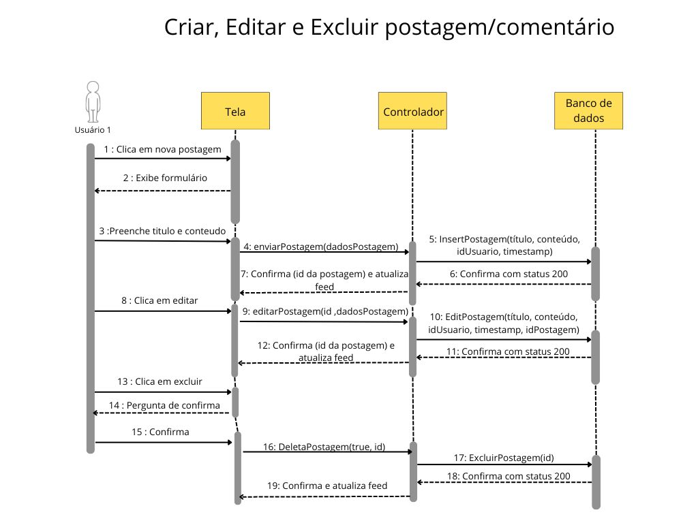
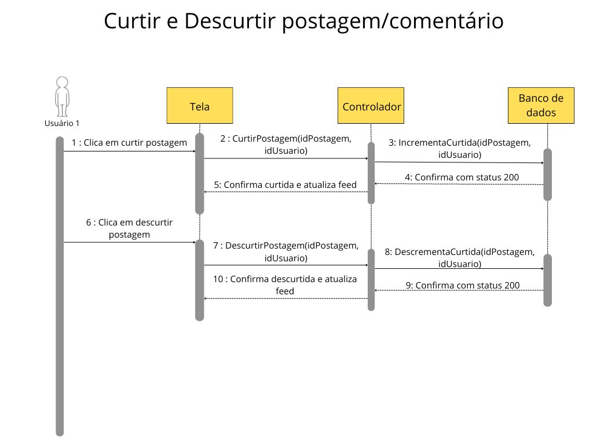

# Diagrama de Sequência

> Esse artefato implementa a correção do artefato do [Diagrama de Sequência](https://unbarqdsw2025-1-turma02.github.io/2025.1-T02-_G7_PlanetarioVirtual_Entrega_02/#/./Modelagem/Dinamica/Sequencia) da entrega 2.
> 
## Introdução

Os Diagramas de Sequência da UML são representações visuais cruciais para modelar e compreender o comportamento dinâmico de sistemas orientados a objetos. Eles ilustram a interação temporal entre diferentes objetos ou participantes dentro de um sistema para realizar uma tarefa ou cenário específico [3](#ref3). Ao focar na ordem cronológica das mensagens trocadas, esses diagramas oferecem uma perspectiva clara do fluxo de controle e das responsabilidades de cada elemento envolvido [4](#ref4).

A utilização de diagramas de sequência é fundamental em diversas etapas do ciclo de vida do desenvolvimento de software. Durante a fase de análise e projeto, eles auxiliam na elicitação e formalização de requisitos funcionais, permitindo que stakeholders e desenvolvedores visualizem como diferentes partes do sistema colaboram para atingir objetivos. Na etapa de implementação, servem como um guia detalhado para a codificação, garantindo que as interações entre os componentes do software sejam implementadas conforme o design estabelecido. Além disso, na fase de testes e manutenção, os diagramas de sequência facilitam a compreensão do comportamento do sistema, auxiliando na identificação de possíveis problemas e na realização de modificações.

Este conjunto de diagramas de sequência UML visa detalhar aspectos específicos do Planetário Virtual, fornecendo uma visão clara e concisa das interações chave entre seus componentes. Cada diagrama explora um cenário particular, destacando a sequência de mensagens trocadas e a linha de vida dos objetos participantes. A análise destes diagramas permite uma compreensão aprofundada do fluxo de informações e do comportamento do sistema em diferentes contextos operacionais, baseado nos casos de uso e nos requisitos.

---

## Metodologia

A construção de um diagrama de sequência UML envolve a identificação e a representação de objetos ou participantes que interagem para realizar um determinado cenário ou caso de uso [1](#ref1). A metodologia segue uma abordagem cronológica, onde as interações são dispostas em ordem temporal de cima para baixo, refletindo o fluxo de eventos ao longo do tempo [4](#ref4).

**Elementos Fundamentais:**

1.  **Linhas de Vida (Lifelines):** Representadas por linhas verticais tracejadas, as linhas de vida simbolizam a existência de um objeto ou participante durante a interação. O nome do objeto (com sua classe, se aplicável) é geralmente colocado no topo da linha de vida, dentro de um retângulo.

2.  **Mensagens:** As interações entre os objetos são representadas por setas direcionadas que conectam as linhas de vida. O tipo da seta e o rótulo da mensagem indicam a natureza da interação:
    * **Mensagem Síncrona:** Representada por uma seta sólida com ponta de flecha fechada. O emissor aguarda uma resposta antes de prosseguir.
    * **Mensagem Assíncrona:** Representada por uma seta sólida com ponta de flecha aberta. O emissor não espera uma resposta imediata e continua sua execução.
    * **Mensagem de Retorno:** Representada por uma seta tracejada com ponta de flecha aberta, indicando o retorno de um valor ou sinal para o objeto que enviou a mensagem síncrona.
    * **Mensagem de Criação:** Representada por uma seta tracejada com a etiqueta `<<create>>` apontando para o início da linha de vida do objeto criado.
    * **Mensagem de Destruição:** Representada por uma seta com uma ponta em forma de "X" no final da linha de vida do objeto destruído.

3.  **Caixa de Ativação (Activation Box):** Um retângulo estreito sobre a linha de vida indica o período durante o qual o objeto está executando uma ação em resposta a uma mensagem. Para mensagens síncronas, a caixa de ativação do objeto que envia a mensagem se estende até que ele receba o retorno.

4.  **Notas:** Anotações textuais podem ser adicionadas ao diagrama para fornecer informações adicionais ou esclarecimentos sobre aspectos específicos da interação. Elas são geralmente conectadas aos elementos relevantes por meio de linhas tracejadas.

5.  **Fragmentos:** Para modelar comportamentos mais complexos, como loops, condições e opções, os diagramas de sequência utilizam fragmentos. Estes são representados por retângulos com um operador na parte superior esquerda (por exemplo, `alt` para alternativas, `opt` para opcional, `loop` para repetição) e contêm uma ou mais partições (operandos) que definem as diferentes partes do comportamento.

**Processo de Construção:**

1.  **Identificar os Participantes:** Determina-se os objetos ou atores que interagem no cenário em questão.
2.  **Definir o Cenário:** Descreve-se o fluxo de eventos que você deseja modelar.
3.  **Ordenar as Interações:** Coloca-se as mensagens em ordem cronológica, de cima para baixo.
4.  **Desenhar as Linhas de Vida:** Desenha-se uma linha de vida vertical para cada participante.
5.  **Adicionar as Mensagens:** Conecta-se as linhas de vida com setas rotuladas para representar as mensagens trocadas.
6.  **Incluir Caixas de Ativação:** Desenha-se retângulos sobre as linhas de vida para indicar os períodos de atividade.
7.  **Utilizar Fragmentos (Opcional):** Se necessário, usa-se fragmentos para modelar lógica condicional ou repetitiva.
8.  **Adicionar Notas (Opcional):** Inclui-se notas para fornecer contexto ou explicações adicionais.

Ao seguir esta metodologia e utilizar os elementos de forma adequada, foram criados os diagramas apresentados abaixo sobre o Planetário Virtual.

---

## Diagramas de Sequência

Baseado na metodologia acima e nos [Casos de Uso](/Modelagem/Organizacional/CasosDeUso.md) elaborados pela equipe, foram desenvolvidos os diagramas de Sequência UML durante uma reunião online, cuja ata pode ser visualizada clicando aqui: [Ata - Diagrama de Sequência](/Modelagem/Extra/Atas/ata7.md). Algumas ferramentas diferentes foram utilizadas pelo grupo, tais como o [Canva e o Mermaid Live Editor](Modelagem/Extra/2.5.2Ferramentas.md), um gerador de diagramas a partir de código mermaid.

O grupo avaliou a especificação textual dos [Casos de Uso](/Modelagem/Organizacional/CasosDeUso.md) para elaborar o fluxo do diagrama de sequência, e foi decidido que alguns casos de uso seriam unificados, devido à quantidade e proximidade entre eles.

Abaixo podem ser visualizados os diagramas que foram desenvolvidos, seguidos por seus respectivos títulos e autores responsáveis.

---

<b>Criar/Editar/Excluir Postagem e Comentário</b>

<b>Tabela 1:</b> Criar/Editar/Excluir Postagem e Comentário 

<b>Autor:</b> [Milena Rocha](https://github.com/milenafrocha), 2025. 

---

<b>Curtir/Descurtir Postagem e Comentário</b>

<b>Tabela 2:</b> Curtir/Descurtir Postagem e Comentário 

<b>Autor:</b> [Milena Rocha](https://github.com/milenafrocha), 2025. 

---

<b>Criar Conta</b>

<b>Tabela 3:</b> Criar Conta 

<b>Autor:</b> [Raphaela Guimarães](https://github.com/raphaiela), 2025. 

---

<b>Logar na Conta</b>

<b>Tabela 4:</b> Logar na Conta 

<b>Autor:</b> [Raphaela Guimarães](https://github.com/raphaiela), 2025. 

---

<b>Editar Perfil</b>

<b>Tabela 5:</b> Editar Perfil 

<b>Autor:</b> [Raphaela Guimarães](https://github.com/raphaiela), 2025. 

---

<b>Excluir Perfil</b>

<b>Tabela 6:</b> Excluir Perfil 

<b>Autor:</b> [Raphaela Guimarães](https://github.com/raphaiela), 2025. 

---

<b>Administrador: Exclui Conta de Usuário</b>

<b>Tabela 7:</b> Administrador: Exclui Conta de Usuário 

<b>Autor:</b> [Rafael Pereira](https://github.com/rafgpereira), 2025. 

---

<b>Administrador: Exclui Postagem de Usuário</b>

<b>Tabela 8:</b> Administrador: Exclui Postagem de Usuário 

<b>Autor:</b> [Rafael Pereira](https://github.com/rafgpereira), 2025. 

---

<b>Administrador: Exclui Comentário de Usuário</b>

<b>Tabela 9:</b> Administrador: Exclui Comentário de Usuário 

<b>Autor:</b> [Rafael Pereira](https://github.com/rafgpereira), 2025. 

---

<b>Visualizar Fórum</b>

<b>Tabela 10:</b> Visualizar fórum 

<b>Autor:</b> [João Pedro](https://github.com/JoaoPedrooSS), 2025. 

---

<b>Visualizar Foto do Dia</b>

<b>Tabela 11:</b> Visualizar Foto do Dia 

<b>Autor:</b> [Manoel Moura](https://github.com/manoelmoura), 2025. 

---

<b>Visualizar Astro</b>

<b>Tabela 12:</b> Visualizar Astro 

<b>Autor:</b> [Manoel Moura](https://github.com/manoelmoura), 2025. 

---

## Referências Bibliográficas

>  1.  BOOCH, Grady; RUMBAUGH, James; JACOBSON, Ivar. *The Unified Modeling Language User Guide*. 2nd ed. Addison-Wesley Professional, 2005.
>
>  2.  FOWLER, Martin. *UML Essencial: Um breve guia para a linguagem-padrão de modelagem de objetos*. 3rd ed. Addison-Wesley Professional, 2003.
>
>  3.  SATZINGER, John W.; JACKSON, Robert B.; BURD, Stephen D. *Systems Analysis and Design in a Changing World*. 6th ed. Course Technology, 2012.
>
>  4.  LARMAN, Craig. *Applying UML and Patterns: An Introduction to Object-Oriented Analysis and Design and Iterative Development*. 3rd ed. Prentice Hall, 2004.
>

## Histórico de Versões

| Versão | Data       | Descrição                                      | Autor               | Revisor            |
|--------|------------|------------------------------------------------|---------------------|--------------------|
| 1.0 | 08/05/2025 | Criação do documento com divisões a serem preenchidas conforme o padrão.| [Rafael Pereira](https://github.com/rafgpereira)  | [João Pedro](https://github.com/JoaoPedrooSS) |
| 1.1 | 08/05/2025 | Adição da introdução e metodologia, com suas respectivas referências.| [Rafael Pereira](https://github.com/rafgpereira)  | [Milena Rocha](https://github.com/milenafrocha) |
| 1.2 | 08/05/2025 | Adição dos Diagramas de Sequência completos| [Rafael Pereira](https://github.com/rafgpereira)  | [João Pedro](https://github.com/JoaoPedrooSS)  |
| 3.0 | 26/05/2025 | Correções para linhas tracejadas no diagrama de sequência de criar e curtir| [Milena Rocha](https://github.com/milenafrocha)  | [João Pedro](https://github.com/JoaoPedrooSS)  |